# 1. Introduction

#### Review Pages

1. Introduction  
[2. Transfer Rate Reading Tests](page-02.md)  
[3. CD Error Correction Tests](page-03.md)  
[4. DVD Error Correction Tests](page-04.md)  
[5. Protected Disc Tests](page-05.md)  
[6. DAE Tests](page-06.md)  
[7. Protected AudioCDs](page-07.md)  
[8. CD Recording Tests](page-08.md)  
[9. Writing Quality Tests - 3T Jitter Tests](page-09.md)  
[10. Writing Quality Tests - C1 / C2 Error Measurements](page-10.md)  
[11. Writing Quality Tests - Clover System Tests](page-11.md)  
[12. DVD Recording Tests](page-12.md)  
[13. Autostrategy](page-13.md)  
[14. PlexTools Scans - Page 1](page-14.md)  
[15. PlexTools Scans - Page 2](page-15.md)  
[16. PlexTools Scans - Page 3](page-16.md)  
[17. PlexTools Scans - Page 4](page-17.md)  
[18. PlexTools Scans - Page 5](page-18.md)  
[19. PlexTools Scans - Page 6](page-19.md)  
[20. PlexTools Scans - Page 7](page-20.md)  
[21. PlexTools Scans - Page 8](page-21.md)  
[22. DVD+R DL - Page 1](page-22.md)  
[23. DVD+R DL - Page 2](page-23.md)  
[24. PX-716A vs. SA300 - Page 1](page-24.md)  
[25. PX-716A vs. SA300 - Page 2](page-25.md)  
[26. PX-716A vs. SA300 - Page 3](page-26.md)  
[27. PX-716A vs. SA300 - Page 4](page-27.md)  
[28. Booktype BitSetting](page-28.md)  
[29. Conclusion](page-29.md)  
[30. Firmware 1c04 beta - Page 2](page-30.md)  
[31. Q-Check TA Function](page-31.md)  
[32. Firmware 1c04 beta - Page 1](page-32.md)  

### **Plextor PX-716A Burner - Page 1**

Plextor,
a leading manufacturer of optical storage devices, announced the PX-716A
which boasts blazing fast writing/re-writing speeds. The drive was originally
sold in the U.S., but from the start,
the first hardware revisions (TLA#001) were returned, with Plextor feeling
the drive needed further fine-tuning before reaching end users. After the drive
reached its second hardware revision with 1.02 firmware (TLA#202), it arrived
in our labs
where we received it with great expectations and at the same time, many reservations
surrounding its reading and mostly writing quality.

Many PX-712A users were disappointed with the writing quality, even with
the latest firmware revision, something that made us double-check all our test
results to ensure the posted results would be 100% correct, at least with
the tested
firmware
revision. Plextor, at the last minute, "changed" the drive specs and "boosted" the
writing speeds for the DVD±R DL formats up to 6X with an upcoming firmware
revision that is expected in the middle of March 2005. Of course, our review is based
on the already published v1.02 and v1.03 releases, while we decided not to
test the published v1.04 beta that added experimental DVD-R DL writing, since
no
DVD-R
DL media
is currently available on the market. Let's begin by noting the drive's
main features.

**- Features**

 is supported
for recording at high quality and optimum speed.

****** is a self-learning writing technology that determines the standard deviation of any blank disc and automatically optimizes the write strategy for unknown media, enabling high-quality disc recording. AUTOSTRATEGY technology is the culmination of five years of research and development by Taiyo Yuden, a leading Japanese supplier of quality CD and DVD recording media. Below is a graph, which according to Plextor shows the effects of AutoStrategy even with HQ media:

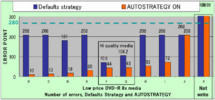

****** controls the laser in three dimensions, to ensure high-quality writing and reading if the disc surface has imperfections. Below is a graph, which according to Plextor shows the Jitter improvement with the IntelligentTilt technology:

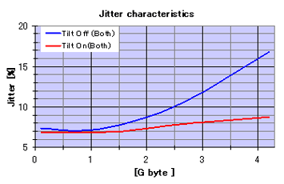

The VariRec
feature can be applied not only to Audio CD-R discs but also DVD±RW
media. The user can select some settings during recording preparation in order
to obtain a more personalized sound tone. The feature is fully controlled from
within the PlexTools software, available in the Plextor retail package, and
works
for CD at 4X and 8X and for DVD at 2X and 4X writing speeds. Nero and other
programs support this feature as well.

The PoweRec technology ensures the quality of CD and DVD recordings. Low-quality media is often the source of disc errors during high-speed recording. PoweRec checks the quality of the inserted CD/DVD media and automatically selects the optimum (maximum) writing speed, giving the highest quality results.

Other interesting features of the PX-716A are:

-  allows high-capacity storage of up to 900 MB on a 700 MB CD-R disc. With
  this advanced feature, you can increase the maximum writing capacity by up
  to 30%.
-  offers password protection for your disc and other valuable data
-  checks
  and reports written disc quality - C1/C2 for CD, PI/POF and TA for
  DVD
  (Time Analyzer checks T3-T11 and T14), track and focus errors, beta and jitter.
-  enables users to vary tray load/unload speed, spin up/down speed and write/read speeds
- Shorter drive length compared with PX-712A for a small-form-factor PC

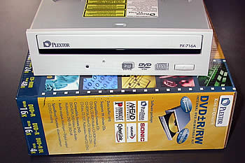

**- Specifications**

<table align="center" border="1" width="490">
<tbody><tr>
<td colspan="4">
<b>Data Transfer Rate</b>
</td>
</tr>
<tr>
<td width="85"><b>Burst </b></td>
<td colspan="3">
66MB/s
</td>
</tr>
<tr>
<td rowspan="2"><b>Write</b></td>
<td width="135">
<b>DVD+R</b>
</td>
<td width="129">
<b>DVD-R</b>
</td>
<td width="113">
<b>CD-R</b>
</td>
</tr>
<tr>
<td>
16x: 22.160KB/s (CAV)
      12x: 16.620KB/s (PCAV)
      6-8x: 8.310-11.080KB/s (PCAV) 
      6x: 8.310KB/s (CLV)
      4x: 5.540KB/s (CLV) 
      2.4x: 3.324KB/s (CLV)
      <b>DVD+R DL</b> 
      4x: 5.540KB/s (CLV)
    2.4x: 3.324KB/s (CLV)    
</td>
<td>
16x: 22.160KB/s (CAV)
        12x: 16.620KB/s (PCAV)      
        6-8x: 8.310-11.080KB/s (PCAV)      
        6x: 8.310KB/s (CLV)      
        4x: 5.540KB/s (CLV)
        2x: 2.770KB/s (CLV)      
    
</td>
<td>
48x: 7.200KB/s (CAV)
      32x: 4.800KB/s (PCAV)
      16x: 2.400KB/s (CLV)
      8x: 1.200KB/s (CLV) 
    4x: 600KB/s (CLV)
</td>
</tr>
<tr>
<td rowspan="2"><b>ReWrite</b></td>
<td>
<b>DVD+RW</b>
</td>
<td>
<b>DVD-RW</b>
</td>
<td>
<b>CD-RW</b>
</td>
</tr>
<tr>
<td>
6-8x: 8.310-11.080KB/s (PCAV)
      6x: 8.310KB/s (CLV) 
      4x: 5.540KB/s (CLV)
    2.4x: 3.324KB/s (CLV)    
</td>
<td>
4x: 5.540KB/s (CLV)
      2x: 2.770KB/s (CLV) 
    1x: 1.385KB/s (CLV)
</td>
<td>
24x: 3.600KB/s (PCAV)
      10x: 1.500KB/s (CLV) 
    4x: 600KB/s (CLV)
</td>
</tr>
<tr>
<td rowspan="2"><b>Read</b></td>
<td colspan="2">
<b>DVD-ROM</b>
</td>
<td>
<b>CD-ROM</b>
</td>
</tr>
<tr>
<td colspan="2">
6-16x CAV
      5-12x CAV 
      3-8x CAV
      2-5x CAV    
    2x CLV
</td>
<td>
20-48x CAV
      17-40x CAV 
      14-32x CAV
      10-24x CAV 
      8x CLV
    4x CLV    
</td>
</tr>
<tr>
<td><b>Access Time</b></td>
<td colspan="3">&lt;150ms (DVD)
    &lt;100ms (CD)</td>
</tr>
<tr>
<td><b>Data Buffer</b></td>
<td colspan="3">8MB</td>
</tr>
<tr>
<td><b>Error Rate</b></td>
<td colspan="3">Mode1: less than 10-12bits
    Mode2: less than 10-9bits    </td>
</tr>
<tr>
<td><b>MTBF</b></td>
<td colspan="3">60.000 POH</td>
</tr>
<tr>
<td><b>Tray Loading Eject</b></td>
<td colspan="3">50.000 times</td>
</tr>
<tr>
<td><b>Warranty</b></td>
<td colspan="3">2-year Fast Warranty Service (in EU, Norway and Switzerland: Collect &amp; Return); 1 year in other countries</td>
</tr>
<tr>
<td><b>Dimensions</b></td>
<td colspan="3">146 x 41,3 x 170 mm</td>
</tr>
<tr>
<td><b>Weight</b></td>
<td colspan="3">1 kg</td>
</tr>
</tbody></table>

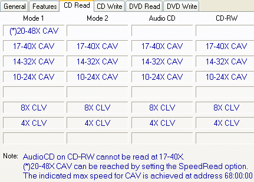

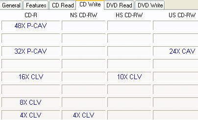

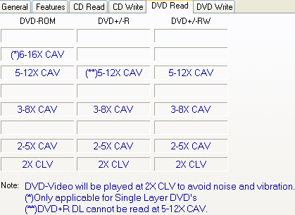

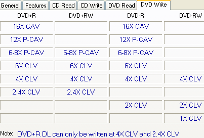

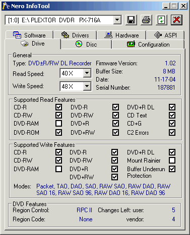

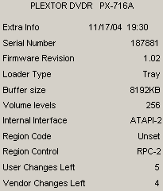

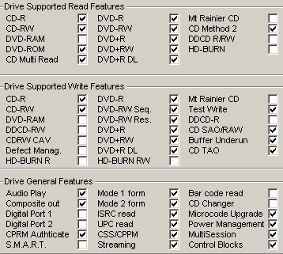

From Info Tool and DVDInfoPro above, we can see that the drive doesn't support
the DVD-RAM format or Mount Rainier. The buffer size is 8MB, while the
drive uses the RPCII region control and allows the user to change the region
five
times. For our tests we set it to region 2 (Europe).

The well-known PlexTools fully supports all the drive's new features, and
users are encouraged to download the latest build from [Plextor's](http://www.plextools.com/download/download.asp) website.

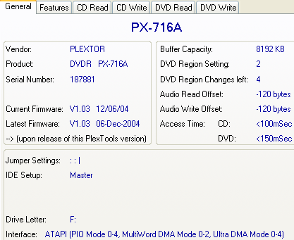

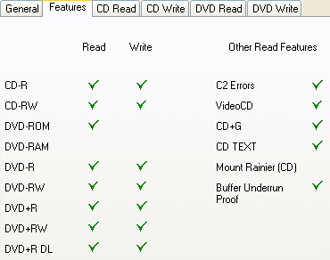

After right-clicking on the drive, you can check the drive's current state:

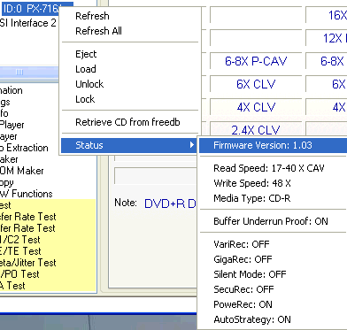

On the settings tab, the user can configure many of the drive's features,
such as CD/DVD reading speed:

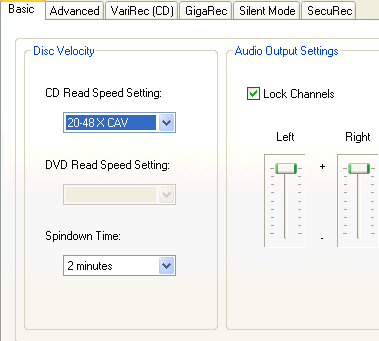

You can enable/disable PoweRec, DMA, SpeedRead, AutoStrategy and, of course, BookType for DVD+R/+R DL:

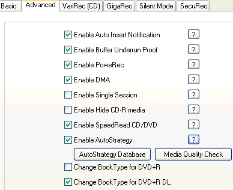

VariRec, as was the case with the PX-712A, is supported for CD and DVD
formats.

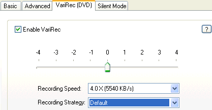

With Silent mode, you can reduce the reading speed for quieter operation:

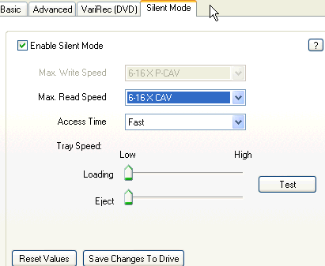

Lastly, in the media info tab, the user can see the media type, manufacturer/media
ID, product revision and, of course, the supported writing speeds for the inserted
media:

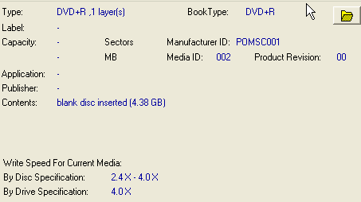

**- Tested Kit / Software Bundle**

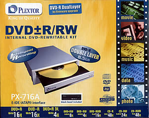

The retail package includes an IDE 80-pin cable, four mounting screws, an
extra jumper, an extra black front bezel, an emergency eject pin,
an installation guide, a front bezel replacement guide, and one disc that
includes the following:

<table align="center" border="1" width="485">
<tbody><tr align="center">
<td width="76">

</td>
<td align="center" width="75">
<b>Ahead</b>
</td>
<td align="center" width="84">
<b>CyberLink</b>
</td>
<td align="center" width="71">
<b>Pinnacle</b>
</td>
<td align="center" width="69">
<b>Sonic</b>
</td>
<td align="center" width="70">
<b>Ulead</b>
</td>
</tr>
<tr align="center">
<td>
<strong>CD/DVD Mastering</strong>
</td>
<td align="center">
Nero Express 6 SE
</td>
<td align="center">
Power2Go 3.0
    (30 days trial)
</td>
<td align="center">
Instant CD/DVD 8.3 LE
    (Limited Edition)
</td>
<td align="center">
RecordNow!
    (30 days trial)
</td>
<td align="center">
Burn Now
    (30 days trial)
</td>
</tr>
<tr align="center">
<td>
<strong>Video Editing</strong>
</td>
<td align="center">
Nero Vision Express 2
    (30 days trial)
</td>
<td align="center">
PowerDirector 3.0
    (30 days trial)
</td>
<td align="center">
Studio 9
    (30 days trial)
</td>
<td align="center">
My DVD
    (30 days trial)
</td>
<td align="center">
Video Studio 8
    (30 days trial)
</td>
</tr>
<tr align="center">
<td>
<strong>DVD Authoring</strong>
</td>
<td align="center">
Nero Vision Express 2
    (30 days trial)
</td>
<td align="center">
PowerProducer 2.0 Gold
    (30 days trial)
</td>
<td align="center">
Studio 9
    (30 days trial)
</td>
<td align="center">
My DVD
    (30 days trial)
</td>
<td align="center">
DVD Movie Factory 3.5 SE
    (30 days trial)
</td>
</tr>
<tr align="center">
<td>
<strong>DVD Player</strong>
</td>
<td align="center">
Nero ShowTime
    (30 days trial)
</td>
<td align="center">
PowerDVD 5.0
    (30 days trial)
</td>
<td align="center">
Instant Cinema
    (Limited Edition)
</td>
<td align="center">

</td>
<td align="center">

</td>
</tr>
<tr align="center">
<td>
<strong>MultiMedia Player</strong>
</td>
<td align="center">
Nero Media Player
</td>
<td align="center">
Media@Show 2.0
    (30 days trial)
</td>
<td align="center">
Instant Audio
</td>
<td align="center">

</td>
<td align="center">

</td>
</tr>
<tr align="center">
<td>
<strong>Duplication</strong>
</td>
<td align="center">

</td>
<td align="center">

</td>
<td align="center">
Instant Copy
</td>
<td align="center">

</td>
<td align="center">

</td>
</tr>
<tr align="center">
<td>
<strong>Other</strong>
</td>
<td align="center">
Nero Recode 2
    (30 days trial)
</td>
<td align="center">
PowerBackup 1.0
    (30 days trial)
</td>
<td align="center">
Instant Backup
</td>
<td align="center">

</td>
<td align="center">

</td>
</tr>
</tbody></table>

The front bezel continues Plextor's traditional front panel look.
Plextor has included an additional black front bezel for users who wish to
change the
look
of their drive to something more...stylish or to match a black
case! The black tray, according to Plextor, reduces the optical distortion
of the laser
beam
while
reading/writing,
producing
higher-quality burns. The activity
indicator lights up green when the device is active and yellow when reading/
accessing a disc.

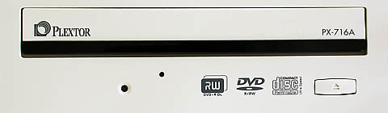

On the rear panel of the drive, you can see the analogue and digital outputs
(SPDIF), the IDE connector and the power input. Plextor will shortly release
S-ATA (PX-716SA) and external USB (PX-716UF) versions.

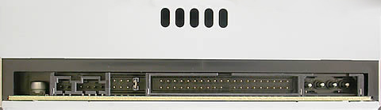

Our drive was manufactured in November of 2004, TLA#0202 (hardware
revision 02, firmware revision 02).

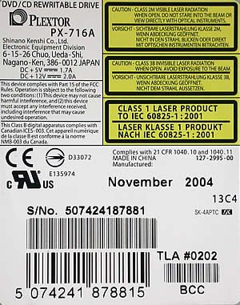

Removing the screws and opening the drive's cover voids the drive's warranty.
For reference purposes, we post the following images. You can click on the
mainboard picture for a higher resolution image:

[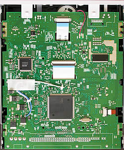](assets/images/inside_large.jpg)

The drive is Sanyo-based, using the following chipset.

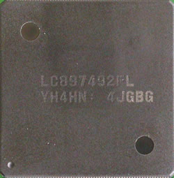

Below you can see the difference between the Plextor 712 and the 716. As you
can see, the new drive is a shorter, half-height drive, making installation easier
for small form-factor PCs.

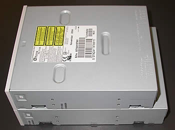

**- Installation**

The drive was installed as secondary master and under Windows XP was recognized
as "**PLEXTOR DVDR PX-716A**". The drive arrived with
firmware revision **v1.02.** For several writing tests, v1.03
was used as well. Below is a screenshot from Nero Burning ROM's specs for
the drive.

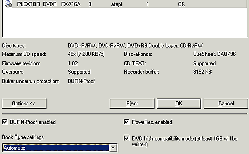

**- Testing software**

In order to perform our tests, we used:

1. [Nero CD-DVD Speed v3.55](http://www.cdspeed2000.com/)
2. CDVD Benchmark v1.21
3. [Nero Info Tool v2.27](http://www.cdspeed2000.com/)
4. [PlexTools v2.18](http://www.plextor.de/)
5. [DVDInfoPro v2.63](http://www.dvdinfopro.com/)
6. [Nero Burning Rom v6.6.0.3](http://www.nero.com/)
7. [CopyToDVD 3.0.35](http://www.vso-software.com/)

---

[Next →](page-02.md)
