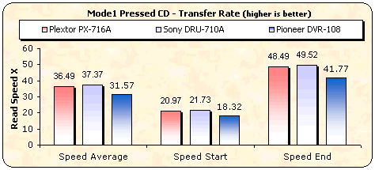
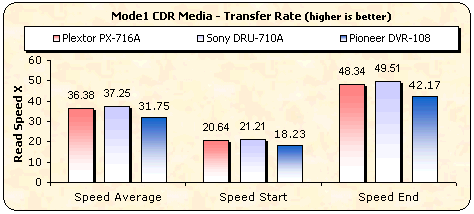
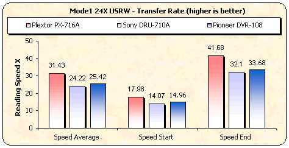
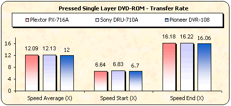
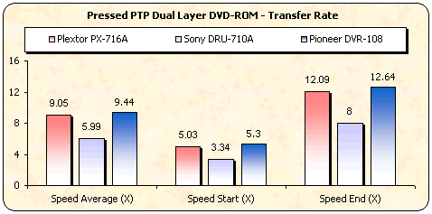
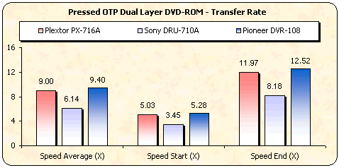
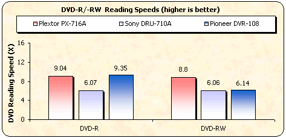
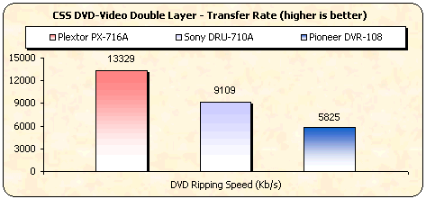

# 2. Transfer Rate Reading Tests

#### Review Pages

[1. Introduction](README.md)  
2. Transfer Rate Reading Tests  
[3. CD Error Correction Tests](page-03.md)  
[4. DVD Error Correction Tests](page-04.md)  
[5. Protected Disc Tests](page-05.md)  
[6. DAE Tests](page-06.md)  
[7. Protected AudioCDs](page-07.md)  
[8. CD Recording Tests](page-08.md)  
[9. Writing Quality Tests - 3T Jitter Tests](page-09.md)  
[10. Writing Quality Tests - C1 / C2 Error Measurements](page-10.md)  
[11. Writing Quality Tests - Clover System Tests](page-11.md)  
[12. DVD Recording Tests](page-12.md)  
[13. Autostrategy](page-13.md)  
[14. PlexTools Scans - Page 1](page-14.md)  
[15. PlexTools Scans - Page 2](page-15.md)  
[16. PlexTools Scans - Page 3](page-16.md)  
[17. PlexTools Scans - Page 4](page-17.md)  
[18. PlexTools Scans - Page 5](page-18.md)  
[19. PlexTools Scans - Page 6](page-19.md)  
[20. PlexTools Scans - Page 7](page-20.md)  
[21. PlexTools Scans - Page 8](page-21.md)  
[22. DVD+R DL - Page 1](page-22.md)  
[23. DVD+R DL - Page 2](page-23.md)  
[24. PX-716A vs. SA300 - Page 1](page-24.md)  
[25. PX-716A vs. SA300 - Page 2](page-25.md)  
[26. PX-716A vs. SA300 - Page 3](page-26.md)  
[27. PX-716A vs. SA300 - Page 4](page-27.md)  
[28. Booktype BitSetting](page-28.md)  
[29. Conclusion](page-29.md)  
[30. Firmware 1c04 beta - Page 2](page-30.md)  
[31. Q-Check TA Function](page-31.md)  
[32. Firmware 1c04 beta - Page 1](page-32.md)  

### **Plextor PX-716A Burner - Page 2**

***Transfer Rate Reading Tests***

**- CD Format**

The new Plextor drive supports up to 48X reading speed for the CD format.

The PX-716A is a fast CD reader, especially with CD-RW media. The manufacturer's specifications have been confirmed.

**- DVD Format**

The reading speed for single-layer DVD media is also fast, as is the case with the competition.

With a PTP DVD-ROM disc, the starting point of the two layers is at the inner part of the disc. The drive reads from the beginning of each layer (inner part), progressing towards the outer part of the disc. Plextor and Pioneer reported the highest speeds, with Pioneer slightly in the lead.

With an OTP Dual Layer disc, the first layer structure is the same as the first layer on a PTP disc. The drive reads the first layer exactly the same way as PTP discs, and at the same speed. The starting point of the second layer of an OTP disc is located at the outer part of the disc. Once again, the Pioneer drive was the fastest, with Plextor following with a negligible difference, however.

With recordable and rewritable media for both formats, the Plextor drive had the best overall performance. Although with ±R media, the Pioneer drive was slightly faster, the Plextor drive maintained a constant speed (around 9X) for ±RW media as well, where both the other drives lagged way behind.

The ripping performance of the Plextor burner with DVD-Video DL movies is excellent, with extremely high speeds, probably the fastest we have ever seen from a burner. The 9.6X average and 11.9X speed at the end of the ripping process confirm this.

**- Appendix**

*Nero CD-DVD Speed Graphs*

- [CD Pressed](https://cdrinfo.com/d7/content/Images/CDSpeed_readings/CDSpeed_reading_CD_pressed.png) / [CD-R](https://cdrinfo.com/d7/content/Images/CDSpeed_readings/CDSpeed_reading_CD-R.png) / [US-RW](https://cdrinfo.com/d7/content/Images/CDSpeed_readings/CDSpeed_reading_HS-RW.png)
- [DVD Pressed SL](https://cdrinfo.com/d7/content/Images/CDSpeed_readings/CDSpeed_reading_DVD_SL_820.png) / [DVD Pressed DL PTP](https://cdrinfo.com/d7/content/Images/CDSpeed_readings/CDSpeed_reading_DVD_DL_840.png) / [DVD Pressed DL OTP](https://cdrinfo.com/d7/content/Images/CDSpeed_readings/CDSpeed_reading_DVD_DL_OTP.png) / [DVD-R](https://cdrinfo.com/d7/content/Images/CDSpeed_readings/CDSpeed_reading_DVD-R.png) / [DVD-RW](https://cdrinfo.com/d7/content/Images/CDSpeed_readings/CDSpeed_reading_DVD-RW.png) / [DVD+R](https://cdrinfo.com/d7/content/Images/CDSpeed_readings/CDSpeed_reading_DVD+R.png) / [DVD+RW](https://cdrinfo.com/d7/content/Images/CDSpeed_readings/CDSpeed_reading_DVD+RW.png)

#### Review Pages

[1. Introduction](README.md)  
2. Transfer Rate Reading Tests  
[3. CD Error Correction Tests](page-03.md)  
[4. DVD Error Correction Tests](page-04.md)  
[5. Protected Disc Tests](page-05.md)  
[6. DAE Tests](page-06.md)  
[7. Protected AudioCDs](page-07.md)  
[8. CD Recording Tests](page-08.md)  
[9. Writing Quality Tests - 3T Jitter Tests](page-09.md)  
[10. Writing Quality Tests - C1 / C2 Error Measurements](page-10.md)  
[11. Writing Quality Tests - Clover System Tests](page-11.md)  
[12. DVD Recording Tests](page-12.md)  
[13. Autostrategy](page-13.md)  
[14. PlexTools Scans - Page 1](page-14.md)  
[15. PlexTools Scans - Page 2](page-15.md)  
[16. PlexTools Scans - Page 3](page-16.md)  
[17. PlexTools Scans - Page 4](page-17.md)  
[18. PlexTools Scans - Page 5](page-18.md)  
[19. PlexTools Scans - Page 6](page-19.md)  
[20. PlexTools Scans - Page 7](page-20.md)  
[21. PlexTools Scans - Page 8](page-21.md)  
[22. DVD+R DL - Page 1](page-22.md)  
[23. DVD+R DL - Page 2](page-23.md)  
[24. PX-716A vs. SA300 - Page 1](page-24.md)  
[25. PX-716A vs. SA300 - Page 2](page-25.md)  
[26. PX-716A vs. SA300 - Page 3](page-26.md)  
[27. PX-716A vs. SA300 - Page 4](page-27.md)  
[28. Booktype BitSetting](page-28.md)  
[29. Conclusion](page-29.md)  
[30. Firmware 1c04 beta - Page 2](page-30.md)  
[31. Q-Check TA Function](page-31.md)  
[32. Firmware 1c04 beta - Page 1](page-32.md)  

[« first](README.md) | [‹ previous](README.md) | [1](README.md) | **2** | [3](page-03.md) | [4](page-04.md) | [5](page-05.md) | [6](page-06.md) | [7](page-07.md) | [8](page-08.md) | [9](page-09.md) | … | [next ›](page-03.md) | [last »](page-32.md)
