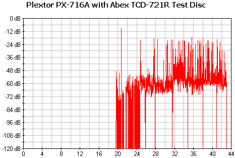
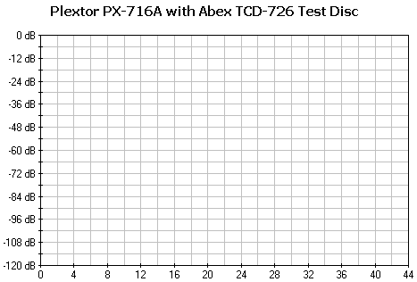

# 3. CD Error Correction Tests

#### Review Pages

[1. Introduction](README.md)  
[2. Transfer Rate Reading Tests](page-02.md)  
**3. CD Error Correction Tests**  
[4. DVD Error Correction Tests](page-04.md)  
[5. Protected Disc Tests](page-05.md)  
[6. DAE Tests](page-06.md)  
[7. Protected AudioCDs](page-07.md)  
[8. CD Recording Tests](page-08.md)  
[9. Writing Quality Tests - 3T Jitter Tests](page-09.md)  
[10. Writing Quality Tests - C1 / C2 Error Measurements](page-10.md)  
[11. Writing Quality Tests - Clover System Tests](page-11.md)  
[12. DVD Recording Tests](page-12.md)  
[13. Autostrategy](page-13.md)  
[14. PlexTools Scans - Page 1](page-14.md)  
[15. PlexTools Scans - Page 2](page-15.md)  
[16. PlexTools Scans - Page 3](page-16.md)  
[17. PlexTools Scans - Page 4](page-17.md)  
[18. PlexTools Scans - Page 5](page-18.md)  
[19. PlexTools Scans - Page 6](page-19.md)  
[20. PlexTools Scans - Page 7](page-20.md)  
[21. PlexTools Scans - Page 8](page-21.md)  
[22. DVD+R DL - Page 1](page-22.md)  
[23. DVD+R DL - Page 2](page-23.md)  
[24. PX-716A vs. SA300 - Page 1](page-24.md)  
[25. PX-716A vs. SA300 - Page 2](page-25.md)  
[26. PX-716A vs. SA300 - Page 3](page-26.md)  
[27. PX-716A vs. SA300 - Page 4](page-27.md)  
[28. Booktype BitSetting](page-28.md)  
[29. Conclusion](page-29.md)  
[30. Firmware 1c04 beta - Page 2](page-30.md)  
[31. Q-Check TA Function](page-31.md)  
[32. Firmware 1c04 beta - Page 1](page-32.md)  

### **Plextor PX-716A Burner - Page 3**

***CD Error Correction Tests***

In the following tests, we check the drive's behavior when it comes to reading scratched/defective discs. The test discs we use are the ABEX series from ALMEDIO.

**The drive doesn't support C2 error information.**

**- ABEX TCD-721R**

|  |  |  |  |
|---|---|---|---|
| **Errors total** | Num: 1376510 |  |  |
| **Errors (Loudness) dB(A)** | Num: 59562 | Avg: -72.7 dB(A) | Max: -9.0 dB(A) |
| **Error Muting Samples** | Num: 6230 | Avg: 1.0 Samples | Max: 9 Samples |
| **Skips Samples** | Num: 8 | Avg: 6.0 Samples | Max: 6 Samples |
| **Total Test Result** | **68.2 points** (out of 100.0 maximum) |  |  |

CD error correction with the Plextor burner is not as good as it could be with the specific test disc. Although the total error count is not as high as with other drives, the maximum error loudness at -9.0 dB(A) is very high, possibly leading to audible errors. The limit in this case is at -35.0 dB(A). The total score of 68.2 out of 100 reflects the general performance.

**- ABEX TCD-726**

|  |  |  |  |
|---|---|---|---|
| **Errors total** | Num: 0 |  |  |
| **Errors (Loudness) dB(A)** | Num: 0 | Avg: -174.0 dB(A) | Max: -174.0 dB(A) |
| **Error Muting Samples** | Num: 0 | Avg: 0.0 Samples | Max: 0 Samples |
| **Skips Samples** | Num: 0 | Avg: 0.0 Samples | Max: 0 Samples |
| **Total Test Result** | **100.0 points** (out of 100.0 maximum) |  |  |

The Plextor PX-716A received a perfect score of 100.0 with the ABEX TCD-726 test disc.

**- CD-Check Audio Test Disc**

The CD-Check Test Disc is a very useful tool for evaluating the sound reproduction/error correction capabilities of a CD player. The disc offers a signal combination with disc error patterns to rate the drive's abilities to read music and reproduce it completely. Five tracks on the disc contain a sequence of progressively difficult tests. These tracks are referred to as Check Level-1 through Check Level-5.

The files are reproduced (played) through a software multimedia player (i.e., Windows Media Player). Each level is considered passed if the tone coming out from the speakers is smooth and continuous, without interruptions, skipping, or looping. The higher the Check Level passed, the more reliable the sound reproduction of the tested device.

| **Error Level** | **1** | **2** | **3** | **4** | **5** |
|---|---:|---:|---:|---:|---:|
| Philips ED16DVDR | 5/5 | 5/5 | 5/5 | 5/5 | 4/5 |

Very good, if not excellent, performance.

**- Conclusion**

The CD error correction for the Plextor burner depends on the defect type. Hence, we saw not-so-good performance with the ABEX TCD-721R test disc but excellent performance with the CD-Check Audio Test Disc. However, the CD error correction is generally good.

#### Review Pages

[1. Introduction](README.md)  
[2. Transfer Rate Reading Tests](page-02.md)  
**3. CD Error Correction Tests**  
[4. DVD Error Correction Tests](page-04.md)  
[5. Protected Disc Tests](page-05.md)  
[6. DAE Tests](page-06.md)  
[7. Protected AudioCDs](page-07.md)  
[8. CD Recording Tests](page-08.md)  
[9. Writing Quality Tests - 3T Jitter Tests](page-09.md)  
[10. Writing Quality Tests - C1 / C2 Error Measurements](page-10.md)  
[11. Writing Quality Tests - Clover System Tests](page-11.md)  
[12. DVD Recording Tests](page-12.md)  
[13. Autostrategy](page-13.md)  
[14. PlexTools Scans - Page 1](page-14.md)  
[15. PlexTools Scans - Page 2](page-15.md)  
[16. PlexTools Scans - Page 3](page-16.md)  
[17. PlexTools Scans - Page 4](page-17.md)  
[18. PlexTools Scans - Page 5](page-18.md)  
[19. PlexTools Scans - Page 6](page-19.md)  
[20. PlexTools Scans - Page 7](page-20.md)  
[21. PlexTools Scans - Page 8](page-21.md)  
[22. DVD+R DL - Page 1](page-22.md)  
[23. DVD+R DL - Page 2](page-23.md)  
[24. PX-716A vs. SA300 - Page 1](page-24.md)  
[25. PX-716A vs. SA300 - Page 2](page-25.md)  
[26. PX-716A vs. SA300 - Page 3](page-26.md)  
[27. PX-716A vs. SA300 - Page 4](page-27.md)  
[28. Booktype BitSetting](page-28.md)  
[29. Conclusion](page-29.md)  
[30. Firmware 1c04 beta - Page 2](page-30.md)  
[31. Q-Check TA Function](page-31.md)  
[32. Firmware 1c04 beta - Page 1](page-32.md)  

[« first](README.md) | [‹ previous](page-02.md) | [1](README.md) | [2](page-02.md) | **3** | [4](page-04.md) | [5](page-05.md) | [6](page-06.md) | [7](page-07.md) | [8](page-08.md) | [9](page-09.md) | … | [next ›](page-04.md) | [last »](page-32.md)
