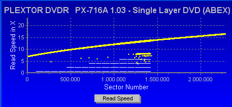
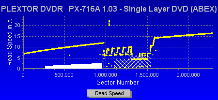
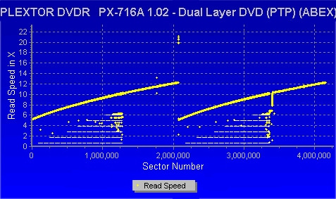
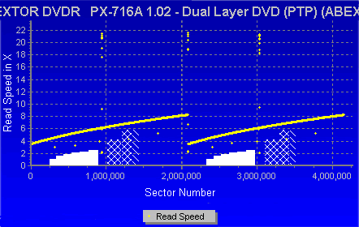

# 4. DVD Error Correction Tests

#### Review Pages

[1. Introduction](README.md)  
[2. Transfer Rate Reading Tests](page-02.md)  
[3. CD Error Correction Tests](page-03.md)  
**4. DVD Error Correction Tests**  
[5. Protected Disc Tests](page-05.md)  
[6. DAE Tests](page-06.md)  
[7. Protected AudioCDs](page-07.md)  
[8. CD Recording Tests](page-08.md)  
[9. Writing Quality Tests - 3T Jitter Tests](page-09.md)  
[10. Writing Quality Tests - C1 / C2 Error Measurements](page-10.md)  
[11. Writing Quality Tests - Clover System Tests](page-11.md)  
[12. DVD Recording Tests](page-12.md)  
[13. Autostrategy](page-13.md)  
[14. PlexTools Scans - Page 1](page-14.md)  
[15. PlexTools Scans - Page 2](page-15.md)  
[16. PlexTools Scans - Page 3](page-16.md)  
[17. PlexTools Scans - Page 4](page-17.md)  
[18. PlexTools Scans - Page 5](page-18.md)  
[19. PlexTools Scans - Page 6](page-19.md)  
[20. PlexTools Scans - Page 7](page-20.md)  
[21. PlexTools Scans - Page 8](page-21.md)  
[22. DVD+R DL - Page 1](page-22.md)  
[23. DVD+R DL - Page 2](page-23.md)  
[24. PX-716A vs. SA300 - Page 1](page-24.md)  
[25. PX-716A vs. SA300 - Page 2](page-25.md)  
[26. PX-716A vs. SA300 - Page 3](page-26.md)  
[27. PX-716A vs. SA300 - Page 4](page-27.md)  
[28. Booktype BitSetting](page-28.md)  
[29. Conclusion](page-29.md)  
[30. Firmware 1c04 beta - Page 2](page-30.md)  
[31. Q-Check TA Function](page-31.md)  
[32. Firmware 1c04 beta - Page 1](page-32.md)  

### **Plextor PX-716A Burner - Page 4**

***DVD Error Correction Tests***

In the following tests, we examine the DVD reading capabilities of the Plextor drive with scratched/defective DVD media. For the tests, we used CDVD Benchmark and Nero CDSpeed. Our reference test media comes from ALMEDIO.

**- Single Layer media**

##### ABEX TDR-821

This is a single-sided, single-layer DVD-ROM with a 4.7GB capacity, and its surface has an artificial scratch of dimensions varying from 0.4 to 3.0 mm.

The following transfer rate picture comes from the CDVD Benchmark v1.21 transfer rate test.

The PX-716A read the disc successfully with negligible fluctuations that mainly appear over the larger defective area.

##### ABEX TDR-825

This is also a single-sided, single-layer DVD-ROM of 4.7GB capacity. The data structure of the disc is exactly the same as that of the TDR-821, with the difference that there are no scratches on it, but instead defective areas of dimensions ranging from 0.5 to 1.1 mm.

There are also fingerprints sized between 65 and 75 micrometers.

Over the fingerprint region, the drive had to drop the speed in order to read the defective area.

**- Dual Layer media**

##### ABEX TDR-841

This is an 8.5GB dual-layer, single-sided DVD-ROM disc with artificial scratches of dimensions ranging from 0.4 to 3.0 mm on both layers.

Once again, there were a few speed fluctuations, but they were less pronounced than with the previous test disc.

##### ABEX TDR-845

The disc is a single-sided, dual-layer DVD-ROM disc with a capacity of 8.5GB. The only difference between the TDR-845 and the TDR-841 is that the former includes defective areas and fingerprints.

The dimensions of the defective areas range from 0.5 to 1.1 mm, and the fingerprints are sized from 65 to 75 micrometers.

Excellent performance...

##### **ABEX TDV-541**

The TDV-541 is a single-sided, dual-layer DVD-VIDEO disc with a capacity of 8.5GB. The disc is based on the TDV-540 series, which is designed for inspection and adjustment of DVD-VIDEO players. The disc checks the layer switch operation from layer 0 to layer 1 and also includes test pictures and test signals for DVD sound files.

The current TDV-541 also checks the error-correcting capabilities of the drive and includes scratches from 0.4 to 3.0 mm.

This disc seems to be a major problem for the drive. Fortunately, the reading process finished successfully without reading errors being reported.

##### **ABEX TDV-545**

The TDV-545 disc is based on the TDV-540 series. It is a single-sided, dual-layer DVD-VIDEO disc with a capacity of 8.5GB. The TDV-545 includes artificial black dots on the data surface, sized from 0.4 to 1.0 mm.

It also has 65–75 micrometer fingerprints.

Once again, the performance is not as good as it should be. Most drives have no problems with the specific disc.

#### Review Pages

[1. Introduction](README.md)  
[2. Transfer Rate Reading Tests](page-02.md)  
[3. CD Error Correction Tests](page-03.md)  
**4. DVD Error Correction Tests**  
[5. Protected Disc Tests](page-05.md)  
[6. DAE Tests](page-06.md)  
[7. Protected AudioCDs](page-07.md)  
[8. CD Recording Tests](page-08.md)  
[9. Writing Quality Tests - 3T Jitter Tests](page-09.md)  
[10. Writing Quality Tests - C1 / C2 Error Measurements](page-10.md)  
[11. Writing Quality Tests - Clover System Tests](page-11.md)  
[12. DVD Recording Tests](page-12.md)  
[13. Autostrategy](page-13.md)  
[14. PlexTools Scans - Page 1](page-14.md)  
[15. PlexTools Scans - Page 2](page-15.md)  
[16. PlexTools Scans - Page 3](page-16.md)  
[17. PlexTools Scans - Page 4](page-17.md)  
[18. PlexTools Scans - Page 5](page-18.md)  
[19. PlexTools Scans - Page 6](page-19.md)  
[20. PlexTools Scans - Page 7](page-20.md)  
[21. PlexTools Scans - Page 8](page-21.md)  
[22. DVD+R DL - Page 1](page-22.md)  
[23. DVD+R DL - Page 2](page-23.md)  
[24. PX-716A vs. SA300 - Page 1](page-24.md)  
[25. PX-716A vs. SA300 - Page 2](page-25.md)  
[26. PX-716A vs. SA300 - Page 3](page-26.md)  
[27. PX-716A vs. SA300 - Page 4](page-27.md)  
[28. Booktype BitSetting](page-28.md)  
[29. Conclusion](page-29.md)  
[30. Firmware 1c04 beta - Page 2](page-30.md)  
[31. Q-Check TA Function](page-31.md)  
[32. Firmware 1c04 beta - Page 1](page-32.md)  

[« first](README.md) | [‹ previous](page-03.md) | [1](README.md) | [2](page-02.md) | [3](page-03.md) | **4** | [5](page-05.md) | [6](page-06.md) | [7](page-07.md) | [8](page-08.md) | [9](page-09.md) | … | [next ›](page-05.md) | [last »](page-32.md)
