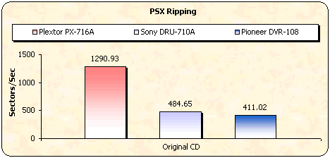
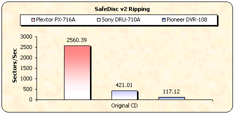
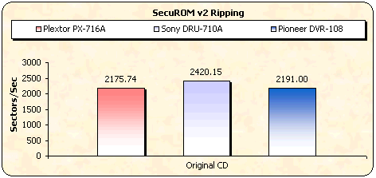

# 5. Protected Disc Tests

#### Review Pages

[1. Introduction](README.md)  
[2. Transfer Rate Reading Tests](page-02.md)  
[3. CD Error Correction Tests](page-03.md)  
[4. DVD Error Correction Tests](page-04.md)  
**5. Protected Disc Tests**  
[6. DAE Tests](page-06.md)  
[7. Protected AudioCDs](page-07.md)  
[8. CD Recording Tests](page-08.md)  
[9. Writing Quality Tests - 3T Jitter Tests](page-09.md)  
[10. Writing Quality Tests - C1 / C2 Error Measurements](page-10.md)  
[11. Writing Quality Tests - Clover System Tests](page-11.md)  
[12. DVD Recording Tests](page-12.md)  
[13. Autostrategy](page-13.md)  
[14. PlexTools Scans - Page 1](page-14.md)  
[15. PlexTools Scans - Page 2](page-15.md)  
[16. PlexTools Scans - Page 3](page-16.md)  
[17. PlexTools Scans - Page 4](page-17.md)  
[18. PlexTools Scans - Page 5](page-18.md)  
[19. PlexTools Scans - Page 6](page-19.md)  
[20. PlexTools Scans - Page 7](page-20.md)  
[21. PlexTools Scans - Page 8](page-21.md)  
[22. DVD+R DL - Page 1](page-22.md)  
[23. DVD+R DL - Page 2](page-23.md)  
[24. PX-716A vs. SA300 - Page 1](page-24.md)  
[25. PX-716A vs. SA300 - Page 2](page-25.md)  
[26. PX-716A vs. SA300 - Page 3](page-26.md)  
[27. PX-716A vs. SA300 - Page 4](page-27.md)  
[28. Booktype BitSetting](page-28.md)  
[29. Conclusion](page-29.md)  
[30. Firmware 1c04 beta - Page 2](page-30.md)  
[31. Q-Check TA Function](page-31.md)  
[32. Firmware 1c04 beta - Page 1](page-32.md)  

### **Plextor PX-716A Burner - Page 5**

***Protected Disc Tests***

**- Reading Tests**

To create images of the various protected titles on the hard disk, we used Alcohol 120% software and the appropriate settings, according to the protection type of the inserted discs. Below you can see the duration of each process as well as the transfer rate in each case.

| **Game Title** | **Protection Scheme** | **Duration** | **Reading speed** |
|---|---|---:|---:|
| PSX "NBA Jam Extreme" | LibCrypt | 01:10min | 1291 sectors/sec |
| Serious Sam The Second Encounter v1.07 | SafeDisc v.2.60.052 | 02:11min | 2560 sectors/sec |
| VRally II | SecuROM v.2 | 02:38min | 2176 sectors/sec |

Excellent performance with very fast transfer rates. The performance with SafeDisc protection is one of the fastest we have experienced.

**- Writing Tests**

The PX-716A recorder supports the DAO-RAW writing mode. To check the drive's EFM correction status, we used 5 different game titles with different SafeDisc 2 versions, with the latest software patches installed. After making images of the various titles on the hard disk, we burned them (at maximum speed) with Alcohol 120% v1.9.2.1705. Two different discs were created for each title: one with "Bypass EFM error" enabled and another with the function disabled.

- FIFA 2004 - SafeDisc v3.1x
- The Sims Superstar - SafeDisc v2.9x
- The Sims Unleashed - SafeDisc v2.8x
- Serious Sam Second Encounter - SafeDisc v2.51.021
- Max Payne - SafeDisc v2.51.020

The table below shows the results of the attempted backups and whether they worked (game installed / played normally) or not.

<table>
  <tr>
    <th rowspan="2">Drive</th>
    <th colspan="2">FIFA 2004 <strong>SD v3.1x</strong></th>
    <th colspan="2">Sims Superstar <strong>SD v2.9x</strong></th>
    <th colspan="2">Sims Unleashed <strong>SD v2.8x</strong></th>
    <th colspan="2">Serious Sam-Second Encounter <strong>SD v2.50.051</strong></th>
    <th colspan="2">Max Payne <strong>SD v2.51.020</strong></th>
  </tr>
  <tr>
    <td>EFM OFF</td>
    <td>EFM ON</td>
    <td>EFM OFF</td>
    <td>EFM ON</td>
    <td>EFM OFF</td>
    <td>EFM ON</td>
    <td>EFM OFF</td>
    <td>EFM ON</td>
    <td>EFM OFF</td>
    <td>EFM ON</td>
  </tr>
  <tr>
    <td>Toshiba SD-M1502</td>
    <td colspan="4" rowspan="3">No</td>
    <td colspan="6" rowspan="3">Yes</td>
  </tr>
  <tr>
    <td>Creative CD5233E</td>
  </tr>
  <tr>
    <td>Plextor PX-716A</td>
  </tr>
</table>

According to our tests, the Plextor drive managed to make working backups of the SafeDisc-protected games up to version 2.8, which is average behavior.

#### Review Pages

[1. Introduction](README.md)  
[2. Transfer Rate Reading Tests](page-02.md)  
[3. CD Error Correction Tests](page-03.md)  
[4. DVD Error Correction Tests](page-04.md)  
**5. Protected Disc Tests**  
[6. DAE Tests](page-06.md)  
[7. Protected AudioCDs](page-07.md)  
[8. CD Recording Tests](page-08.md)  
[9. Writing Quality Tests - 3T Jitter Tests](page-09.md)  
[10. Writing Quality Tests - C1 / C2 Error Measurements](page-10.md)  
[11. Writing Quality Tests - Clover System Tests](page-11.md)  
[12. DVD Recording Tests](page-12.md)  
[13. Autostrategy](page-13.md)  
[14. PlexTools Scans - Page 1](page-14.md)  
[15. PlexTools Scans - Page 2](page-15.md)  
[16. PlexTools Scans - Page 3](page-16.md)  
[17. PlexTools Scans - Page 4](page-17.md)  
[18. PlexTools Scans - Page 5](page-18.md)  
[19. PlexTools Scans - Page 6](page-19.md)  
[20. PlexTools Scans - Page 7](page-20.md)  
[21. PlexTools Scans - Page 8](page-21.md)  
[22. DVD+R DL - Page 1](page-22.md)  
[23. DVD+R DL - Page 2](page-23.md)  
[24. PX-716A vs. SA300 - Page 1](page-24.md)  
[25. PX-716A vs. SA300 - Page 2](page-25.md)  
[26. PX-716A vs. SA300 - Page 3](page-26.md)  
[27. PX-716A vs. SA300 - Page 4](page-27.md)  
[28. Booktype BitSetting](page-28.md)  
[29. Conclusion](page-29.md)  
[30. Firmware 1c04 beta - Page 2](page-30.md)  
[31. Q-Check TA Function](page-31.md)  
[32. Firmware 1c04 beta - Page 1](page-32.md)  

[« first](README.md) | [‹ previous](page-04.md) | [1](README.md) | [2](page-02.md) | [3](page-03.md) | [4](page-04.md) | **5** | [6](page-06.md) | [7](page-07.md) | [8](page-08.md) | [9](page-09.md) | … | [next ›](page-06.md) | [last »](page-32.md)
