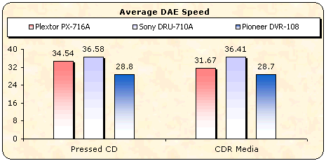
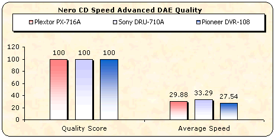
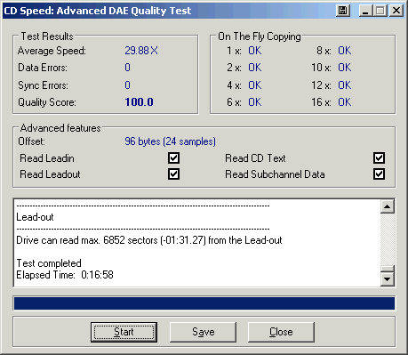
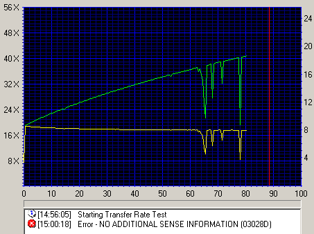
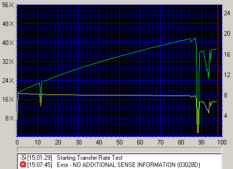

# 6. DAE Tests

#### Review Pages

[1. Introduction](README.md)  
[2. Transfer Rate Reading Tests](page-02.md)  
[3. CD Error Correction Tests](page-03.md)  
[4. DVD Error Correction Tests](page-04.md)  
[5. Protected Disc Tests](page-05.md)  
**6. DAE Tests**  
[7. Protected AudioCDs](page-07.md)  
[8. CD Recording Tests](page-08.md)  
[9. Writing Quality Tests - 3T Jitter Tests](page-09.md)  
[10. Writing Quality Tests - C1 / C2 Error Measurements](page-10.md)  
[11. Writing Quality Tests - Clover System Tests](page-11.md)  
[12. DVD Recording Tests](page-12.md)  
[13. Autostrategy](page-13.md)  
[14. PlexTools Scans - Page 1](page-14.md)  
[15. PlexTools Scans - Page 2](page-15.md)  
[16. PlexTools Scans - Page 3](page-16.md)  
[17. PlexTools Scans - Page 4](page-17.md)  
[18. PlexTools Scans - Page 5](page-18.md)  
[19. PlexTools Scans - Page 6](page-19.md)  
[20. PlexTools Scans - Page 7](page-20.md)  
[21. PlexTools Scans - Page 8](page-21.md)  
[22. DVD+R DL - Page 1](page-22.md)  
[23. DVD+R DL - Page 2](page-23.md)  
[24. PX-716A vs. SA300 - Page 1](page-24.md)  
[25. PX-716A vs. SA300 - Page 2](page-25.md)  
[26. PX-716A vs. SA300 - Page 3](page-26.md)  
[27. PX-716A vs. SA300 - Page 4](page-27.md)  
[28. Booktype BitSetting](page-28.md)  
[29. Conclusion](page-29.md)  
[30. Firmware 1c04 beta - Page 2](page-30.md)  
[31. Q-Check TA Function](page-31.md)  
[32. Firmware 1c04 beta - Page 1](page-32.md)  

### **Plextor PX-716A Burner - Page 6**

***DAE Tests***

**- Pressed and CD-R AudioCD results**

The drive supports up to 40X CAV DAE speed. The following results were reported when using Exact Audio Copy.

As was expected, the Plextor was not the fastest due to its 40X supported speed.

**- Advanced DAE Quality**

The burner achieved a perfect quality score of 100 in Nero's CD Speed Advanced DAE test. The drive can read Lead-in and Lead-out data (with a limitation on this), as well as CD Text and Subchannel data. The reported average speed was 29.88X.

**- Ripping 90min AudioCDs**

**- Ripping 99min AudioCDs**

The drive failed to read both discs. Towards the end of each task, an error was reported.

#### Review Pages

[1. Introduction](README.md)  
[2. Transfer Rate Reading Tests](page-02.md)  
[3. CD Error Correction Tests](page-03.md)  
[4. DVD Error Correction Tests](page-04.md)  
[5. Protected Disc Tests](page-05.md)  
**6. DAE Tests**  
[7. Protected AudioCDs](page-07.md)  
[8. CD Recording Tests](page-08.md)  
[9. Writing Quality Tests - 3T Jitter Tests](page-09.md)  
[10. Writing Quality Tests - C1 / C2 Error Measurements](page-10.md)  
[11. Writing Quality Tests - Clover System Tests](page-11.md)  
[12. DVD Recording Tests](page-12.md)  
[13. Autostrategy](page-13.md)  
[14. PlexTools Scans - Page 1](page-14.md)  
[15. PlexTools Scans - Page 2](page-15.md)  
[16. PlexTools Scans - Page 3](page-16.md)  
[17. PlexTools Scans - Page 4](page-17.md)  
[18. PlexTools Scans - Page 5](page-18.md)  
[19. PlexTools Scans - Page 6](page-19.md)  
[20. PlexTools Scans - Page 7](page-20.md)  
[21. PlexTools Scans - Page 8](page-21.md)  
[22. DVD+R DL - Page 1](page-22.md)  
[23. DVD+R DL - Page 2](page-23.md)  
[24. PX-716A vs. SA300 - Page 1](page-24.md)  
[25. PX-716A vs. SA300 - Page 2](page-25.md)  
[26. PX-716A vs. SA300 - Page 3](page-26.md)  
[27. PX-716A vs. SA300 - Page 4](page-27.md)  
[28. Booktype BitSetting](page-28.md)  
[29. Conclusion](page-29.md)  
[30. Firmware 1c04 beta - Page 2](page-30.md)  
[31. Q-Check TA Function](page-31.md)  
[32. Firmware 1c04 beta - Page 1](page-32.md)  

[« first](README.md) | [‹ previous](page-05.md) | [1](README.md) | [2](page-02.md) | [3](page-03.md) | [4](page-04.md) | [5](page-05.md) | **6** | [7](page-07.md) | [8](page-08.md) | [9](page-09.md) | [10](page-10.md) | … | [next ›](page-07.md) | [last »](page-32.md)
