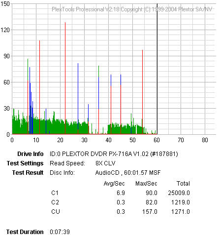
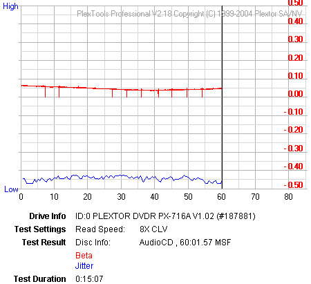
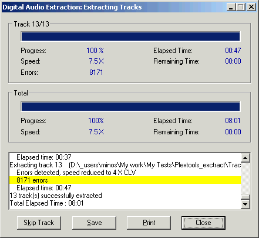

# 7. Protected AudioCDs

#### Review Pages

[1. Introduction](README.md)  
[2. Transfer Rate Reading Tests](page-02.md)  
[3. CD Error Correction Tests](page-03.md)  
[4. DVD Error Correction Tests](page-04.md)  
[5. Protected Disc Tests](page-05.md)  
[6. DAE Tests](page-06.md)  
**7. Protected AudioCDs**  
[8. CD Recording Tests](page-08.md)  
[9. Writing Quality Tests - 3T Jitter Tests](page-09.md)  
[10. Writing Quality Tests - C1 / C2 Error Measurements](page-10.md)  
[11. Writing Quality Tests - Clover System Tests](page-11.md)  
[12. DVD Recording Tests](page-12.md)  
[13. Autostrategy](page-13.md)  
[14. PlexTools Scans - Page 1](page-14.md)  
[15. PlexTools Scans - Page 2](page-15.md)  
[16. PlexTools Scans - Page 3](page-16.md)  
[17. PlexTools Scans - Page 4](page-17.md)  
[18. PlexTools Scans - Page 5](page-18.md)  
[19. PlexTools Scans - Page 6](page-19.md)  
[20. PlexTools Scans - Page 7](page-20.md)  
[21. PlexTools Scans - Page 8](page-21.md)  
[22. DVD+R DL - Page 1](page-22.md)  
[23. DVD+R DL - Page 2](page-23.md)  
[24. PX-716A vs. SA300 - Page 1](page-24.md)  
[25. PX-716A vs. SA300 - Page 2](page-25.md)  
[26. PX-716A vs. SA300 - Page 3](page-26.md)  
[27. PX-716A vs. SA300 - Page 4](page-27.md)  
[28. Booktype BitSetting](page-28.md)  
[29. Conclusion](page-29.md)  
[30. Firmware 1c04 beta - Page 2](page-30.md)  
[31. Q-Check TA Function](page-31.md)  
[32. Firmware 1c04 beta - Page 1](page-32.md)  

### **Plextor PX-716A Burner - Page 7**

***Protected AudioCDs***

For the test procedure, we used three audio discs with different audio copy protections. The ripping process on all protected audio discs was carried out with Exact Audio Copy v0.9beta5.

The tested protected audio discs were:

- *Sony's Key2Audio from "Celine Dion - New Day Has Come"*
- *Cactus Data Shield 200 from "Natalie Imbruglia - White Lilies Island"*

The Cactus Data Shield 200 contains artificial errors that are not easily bypassed by the reader, while the Key2Audio contains a second session, causing problems for readers when trying to read the Table Of Contents (TOC).

The tested tasks are:

- Recognition of the inserted disc (Yes/No).
- Ripping all WAVs (with EAC's Burst Mode) to the hard disk with the copy & compare function.
- Listening to the produced WAVs for any clicks/skips.

The Plextor PX-716A recognized up to the 13th Audio track of the CDS200 disc.

With the "Retrieve Native TOC" option removed, it recognized the 13th Data track.

The test results are shown in the following table:

|  | **Key2Audio** | **CDS200** |
|---|---|---|
| **Plextor PX-716A** | Ripping process completed, EAC reports no problems, Read&Test CRC comparison successful for all tracks | Ripping process completed, EAC reports no problems, Read&Test CRC comparison successful for all tracks |

Both test discs were ripped successfully with the Plextor burner.

- *Cactus Data Shield 200.0.4 - 3.0 build 16a (Aiko Katsukino - The Love Letter)*

This is a "special" CDS200 build, since it doesn't contain any artificial errors during the ripping process. Most problems occur when trying to write the ripped WAV files, since the produced CD-R disc contains C2 and CU errors! This "problem" is rumored to be connected to specific chipset weaknesses.

We ripped the disc contents with EAC and burned the WAV file produced from the Cactus Data Shield 200.0.4 - 3.0 build 16a disc with the latest Nero version as AudioCD+CD-Text. The burned media was checked for C1/C2 errors and for BETA/Jitter errors with PlexTools software using the Plextor PX-712A (firmware v1.05).

|  | **CDS 200.0.4 - 3.0 build 16a** |
|---|---|
| **Plextor PX-716A** | Ripping process completed, EAC reports no problems, Read&Test CRC comparison successful for all tracks |

- C1C2 Error rate from PleXWriter PX-716A (8X CLV reading speed)

The error graphs indicate that the drive cannot produce a 100% error-free disc, while the CU errors (uncorrectable) are a problem. After extracting all WAV files with the Plextor PX-716A and PlexTools DAE Error Correction 5th Level enabled, errors were reported.

#### Review Pages

[1. Introduction](README.md)  
[2. Transfer Rate Reading Tests](page-02.md)  
[3. CD Error Correction Tests](page-03.md)  
[4. DVD Error Correction Tests](page-04.md)  
[5. Protected Disc Tests](page-05.md)  
[6. DAE Tests](page-06.md)  
**7. Protected AudioCDs**  
[8. CD Recording Tests](page-08.md)  
[9. Writing Quality Tests - 3T Jitter Tests](page-09.md)  
[10. Writing Quality Tests - C1 / C2 Error Measurements](page-10.md)  
[11. Writing Quality Tests - Clover System Tests](page-11.md)  
[12. DVD Recording Tests](page-12.md)  
[13. Autostrategy](page-13.md)  
[14. PlexTools Scans - Page 1](page-14.md)  
[15. PlexTools Scans - Page 2](page-15.md)  
[16. PlexTools Scans - Page 3](page-16.md)  
[17. PlexTools Scans - Page 4](page-17.md)  
[18. PlexTools Scans - Page 5](page-18.md)  
[19. PlexTools Scans - Page 6](page-19.md)  
[20. PlexTools Scans - Page 7](page-20.md)  
[21. PlexTools Scans - Page 8](page-21.md)  
[22. DVD+R DL - Page 1](page-22.md)  
[23. DVD+R DL - Page 2](page-23.md)  
[24. PX-716A vs. SA300 - Page 1](page-24.md)  
[25. PX-716A vs. SA300 - Page 2](page-25.md)  
[26. PX-716A vs. SA300 - Page 3](page-26.md)  
[27. PX-716A vs. SA300 - Page 4](page-27.md)  
[28. Booktype BitSetting](page-28.md)  
[29. Conclusion](page-29.md)  
[30. Firmware 1c04 beta - Page 2](page-30.md)  
[31. Q-Check TA Function](page-31.md)  
[32. Firmware 1c04 beta - Page 1](page-32.md)  

[« first](README.md) | [‹ previous](page-06.md) | [1](README.md) | [2](page-02.md) | [3](page-03.md) | [4](page-04.md) | [5](page-05.md) | [6](page-06.md) | **7** | [8](page-08.md) | [9](page-09.md) | [10](page-10.md) | [11](page-11.md) | … | [next ›](page-08.md) | [last »](page-32.md)
