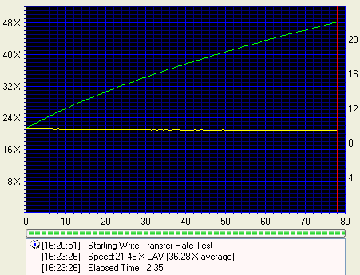
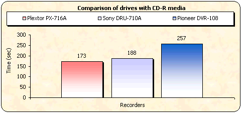
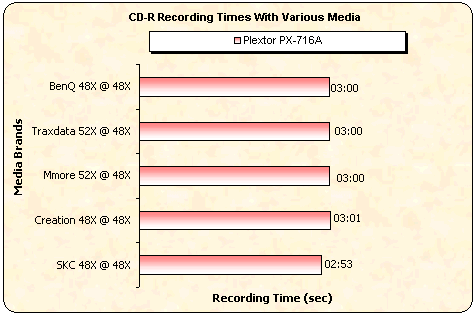
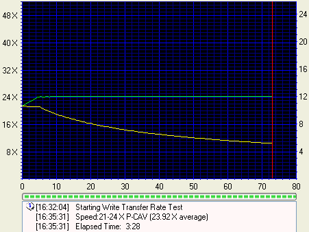

# 8. CD Recording Tests

#### Review Pages

[1. Introduction](README.md)  
[2. Transfer Rate Reading Tests](page-02.md)  
[3. CD Error Correction Tests](page-03.md)  
[4. DVD Error Correction Tests](page-04.md)  
[5. Protected Disc Tests](page-05.md)  
[6. DAE Tests](page-06.md)  
[7. Protected AudioCDs](page-07.md)  
**8. CD Recording Tests**  
[9. Writing Quality Tests - 3T Jitter Tests](page-09.md)  
[10. Writing Quality Tests - C1 / C2 Error Measurements](page-10.md)  
[11. Writing Quality Tests - Clover System Tests](page-11.md)  
[12. DVD Recording Tests](page-12.md)  
[13. Autostrategy](page-13.md)  
[14. PlexTools Scans - Page 1](page-14.md)  
[15. PlexTools Scans - Page 2](page-15.md)  
[16. PlexTools Scans - Page 3](page-16.md)  
[17. PlexTools Scans - Page 4](page-17.md)  
[18. PlexTools Scans - Page 5](page-18.md)  
[19. PlexTools Scans - Page 6](page-19.md)  
[20. PlexTools Scans - Page 7](page-20.md)  
[21. PlexTools Scans - Page 8](page-21.md)  
[22. DVD+R DL - Page 1](page-22.md)  
[23. DVD+R DL - Page 2](page-23.md)  
[24. PX-716A vs. SA300 - Page 1](page-24.md)  
[25. PX-716A vs. SA300 - Page 2](page-25.md)  
[26. PX-716A vs. SA300 - Page 3](page-26.md)  
[27. PX-716A vs. SA300 - Page 4](page-27.md)  
[28. Booktype BitSetting](page-28.md)  
[29. Conclusion](page-29.md)  
[30. Firmware 1c04 beta - Page 2](page-30.md)  
[31. Q-Check TA Function](page-31.md)  
[32. Firmware 1c04 beta - Page 1](page-32.md)  

### **Plextor PX-716A Burner - Page 8**

***CD Recording Tests***

**- CD-R Format**

The drive supports 8X, 16X, 24X, 32X, 40X, and 48X (CAV) writing speeds.

The drive began the task at 21.92X and finished at 49.41X, reporting an average speed of 37.38X, confirming the manufacturer's specifications for 48X CD recording. Click on the image below for details.

**- CD-R Recording Times**

For the burning tests, we created an 80min data compilation through Nero Burning Rom and recorded the data on a 700MB disc. The PX-716A finished the task in **2:53** minutes when writing at 48X. Freecom and Memorex burners, which also support 48X, were faster with times of 2:59min and 2:47min respectively.

The writing performance was stable regardless of the inserted media brand, as our tests showed. Below is a chart listing the corresponding recording times for various media.

**- Other features**

|  |  |
|---|---|
| **Overburning writing** | Up to 99min |
| **CD text reading/writing** | Yes |

**- CD-RW Format**

The PX-716A supports 16X CLV and 24X P-CAV rewriting speeds with **U**ltra **S**peed **R**ewritable **M**edia (US-RW). Below you can see the Nero CD-DVD Speed writing simulation test with blank 24X US-RW media from Mitsubishi Chemicals. The test started at 16.02X and finished at 24.06X, with an average writing speed of 22.51X.

We also used Nero Burning Rom in order to burn a 24X US-RW data disc from Mitsubishi Chemicals. The data compilation we burned had a size of 651 MB, and the duration of the recording process was **3:48** minutes.

**- CD-RW Mount Rainier Tests**

The Plextor burner does not support the Mount Rainier format.

#### Review Pages

[1. Introduction](README.md)  
[2. Transfer Rate Reading Tests](page-02.md)  
[3. CD Error Correction Tests](page-03.md)  
[4. DVD Error Correction Tests](page-04.md)  
[5. Protected Disc Tests](page-05.md)  
[6. DAE Tests](page-06.md)  
[7. Protected AudioCDs](page-07.md)  
**8. CD Recording Tests**  
[9. Writing Quality Tests - 3T Jitter Tests](page-09.md)  
[10. Writing Quality Tests - C1 / C2 Error Measurements](page-10.md)  
[11. Writing Quality Tests - Clover System Tests](page-11.md)  
[12. DVD Recording Tests](page-12.md)  
[13. Autostrategy](page-13.md)  
[14. PlexTools Scans - Page 1](page-14.md)  
[15. PlexTools Scans - Page 2](page-15.md)  
[16. PlexTools Scans - Page 3](page-16.md)  
[17. PlexTools Scans - Page 4](page-17.md)  
[18. PlexTools Scans - Page 5](page-18.md)  
[19. PlexTools Scans - Page 6](page-19.md)  
[20. PlexTools Scans - Page 7](page-20.md)  
[21. PlexTools Scans - Page 8](page-21.md)  
[22. DVD+R DL - Page 1](page-22.md)  
[23. DVD+R DL - Page 2](page-23.md)  
[24. PX-716A vs. SA300 - Page 1](page-24.md)  
[25. PX-716A vs. SA300 - Page 2](page-25.md)  
[26. PX-716A vs. SA300 - Page 3](page-26.md)  
[27. PX-716A vs. SA300 - Page 4](page-27.md)  
[28. Booktype BitSetting](page-28.md)  
[29. Conclusion](page-29.md)  
[30. Firmware 1c04 beta - Page 2](page-30.md)  
[31. Q-Check TA Function](page-31.md)  
[32. Firmware 1c04 beta - Page 1](page-32.md)  

[« first](README.md) | [‹ previous](page-07.md) | [1](README.md) | [2](page-02.md) | [3](page-03.md) | [4](page-04.md) | [5](page-05.md) | [6](page-06.md) | [7](page-07.md) | **8** | [9](page-09.md) | [10](page-10.md) | [11](page-11.md) | [12](page-12.md) | … | [next ›](page-09.md) | [last »](page-32.md)
