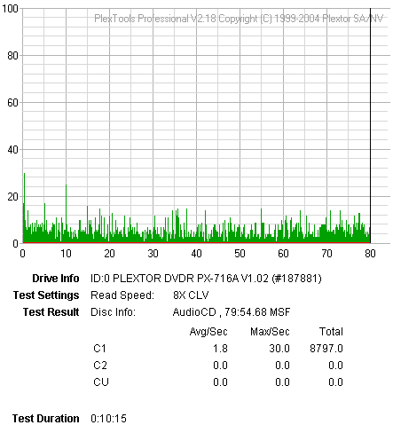
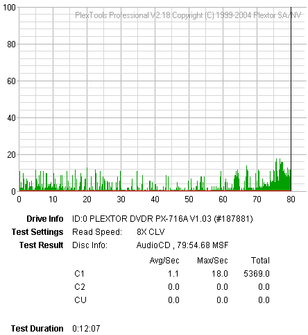
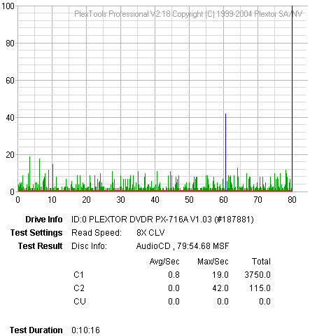
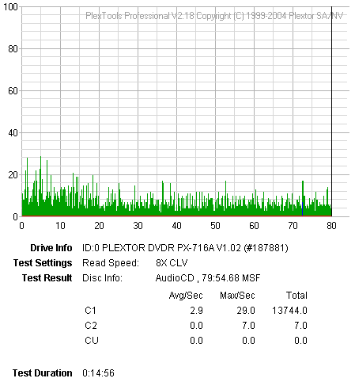
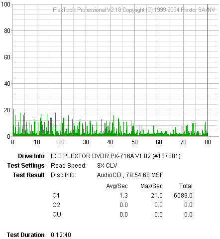

# 10. Writing Quality Tests - C1 / C2 Error Measurements

#### Review Pages

[1. Introduction](README.md)  
[2. Transfer Rate Reading Tests](page-02.md)  
[3. CD Error Correction Tests](page-03.md)  
[4. DVD Error Correction Tests](page-04.md)  
[5. Protected Disc Tests](page-05.md)  
[6. DAE Tests](page-06.md)  
[7. Protected AudioCDs](page-07.md)  
[8. CD Recording Tests](page-08.md)  
[9. Writing Quality Tests - 3T Jitter Tests](page-09.md)  
**10. Writing Quality Tests - C1 / C2 Error Measurements**  
[11. Writing Quality Tests - Clover System Tests](page-11.md)  
[12. DVD Recording Tests](page-12.md)  
[13. Autostrategy](page-13.md)  
[14. PlexTools Scans - Page 1](page-14.md)  
[15. PlexTools Scans - Page 2](page-15.md)  
[16. PlexTools Scans - Page 3](page-16.md)  
[17. PlexTools Scans - Page 4](page-17.md)  
[18. PlexTools Scans - Page 5](page-18.md)  
[19. PlexTools Scans - Page 6](page-19.md)  
[20. PlexTools Scans - Page 7](page-20.md)  
[21. PlexTools Scans - Page 8](page-21.md)  
[22. DVD+R DL - Page 1](page-22.md)  
[23. DVD+R DL - Page 2](page-23.md)  
[24. PX-716A vs. SA300 - Page 1](page-24.md)  
[25. PX-716A vs. SA300 - Page 2](page-25.md)  
[26. PX-716A vs. SA300 - Page 3](page-26.md)  
[27. PX-716A vs. SA300 - Page 4](page-27.md)  
[28. Booktype BitSetting](page-28.md)  
[29. Conclusion](page-29.md)  
[30. Firmware 1c04 beta - Page 2](page-30.md)  
[31. Q-Check TA Function](page-31.md)  
[32. Firmware 1c04 beta - Page 1](page-32.md)  

### **Plextor PX-716A Burner - Page 10**

***Writing Quality Tests - C1 / C2 Error Measurements***

We measured the C1 / C2 error rate of the recorded discs we burned at the maximum 48X supported writing speed. The software used was PleXTools Professional v2.18, and particularly the built-in Q-Check utility. The reader was the same drive, the Plextor PX-716A (firmware v1.02).

***Traxdata 80min 52X @ 48X***

***BenQ 80min 52X @ 48X***

***SKC 80min 48X @ 48X***

***Creation 80min 48X @ 48X***

***MMore 80min 52X @ 48X***

**- Summary**

The CD media burned with the Plextor burner produced C1 errors at normal levels, while the C2 levels were negligible and present in only a single case, that of SKC media. Generally, the quality was good. But let's see what professional equipment will report...

**- Appendix**

| **Media Label** | **ID Code** | **Manufacturer Name** | **Lead Out Time** |
|---|---|---|---|
| Traxdata 52X | 97m15s17f | Ritek | 79:59.70 |
| BenQ 52X | 97m22s67f | Daxon. | 79:59.74 |
| SKC 48X | 97m26s26f | SKC Co., Ltd. | 79:59.73 |
| Creation 48X | 97m27s18f | Plasmon Data Systems Ltd. | 79:59.74 |
| MMore 52X | 97m17s 6f | Moser Baer India, Ltd. | 79:59.74 |

#### Review Pages

[1. Introduction](README.md)  
[2. Transfer Rate Reading Tests](page-02.md)  
[3. CD Error Correction Tests](page-03.md)  
[4. DVD Error Correction Tests](page-04.md)  
[5. Protected Disc Tests](page-05.md)  
[6. DAE Tests](page-06.md)  
[7. Protected AudioCDs](page-07.md)  
[8. CD Recording Tests](page-08.md)  
[9. Writing Quality Tests - 3T Jitter Tests](page-09.md)  
**10. Writing Quality Tests - C1 / C2 Error Measurements**  
[11. Writing Quality Tests - Clover System Tests](page-11.md)  
[12. DVD Recording Tests](page-12.md)  
[13. Autostrategy](page-13.md)  
[14. PlexTools Scans - Page 1](page-14.md)  
[15. PlexTools Scans - Page 2](page-15.md)  
[16. PlexTools Scans - Page 3](page-16.md)  
[17. PlexTools Scans - Page 4](page-17.md)  
[18. PlexTools Scans - Page 5](page-18.md)  
[19. PlexTools Scans - Page 6](page-19.md)  
[20. PlexTools Scans - Page 7](page-20.md)  
[21. PlexTools Scans - Page 8](page-21.md)  
[22. DVD+R DL - Page 1](page-22.md)  
[23. DVD+R DL - Page 2](page-23.md)  
[24. PX-716A vs. SA300 - Page 1](page-24.md)  
[25. PX-716A vs. SA300 - Page 2](page-25.md)  
[26. PX-716A vs. SA300 - Page 3](page-26.md)  
[27. PX-716A vs. SA300 - Page 4](page-27.md)  
[28. Booktype BitSetting](page-28.md)  
[29. Conclusion](page-29.md)  
[30. Firmware 1c04 beta - Page 2](page-30.md)  
[31. Q-Check TA Function](page-31.md)  
[32. Firmware 1c04 beta - Page 1](page-32.md)  

[« first](README.md) | [‹ previous](page-09.md) | [1](README.md) | [2](page-02.md) | [3](page-03.md) | [4](page-04.md) | [5](page-05.md) | [6](page-06.md) | [7](page-07.md) | [8](page-08.md) | [9](page-09.md) | **10** | [11](page-11.md) | [12](page-12.md) | [13](page-13.md) | [14](page-14.md) | … | [next ›](page-11.md) | [last »](page-32.md)
