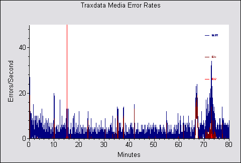
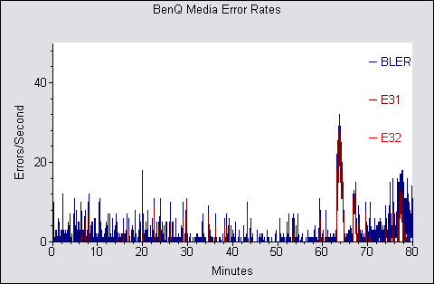
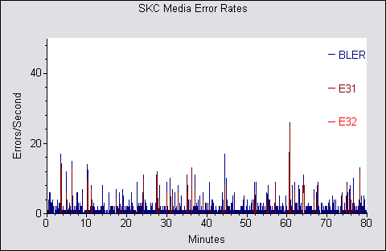
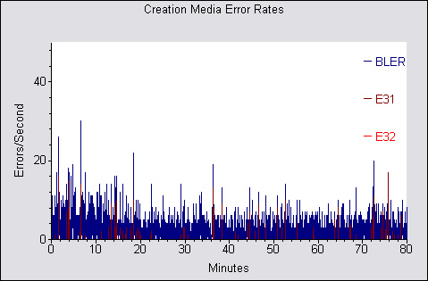
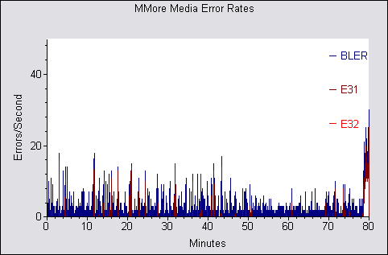
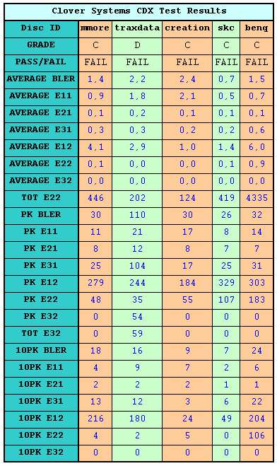

# 11. Writing Quality Tests - Clover System Tests

#### Review Pages

[1. Introduction](README.md)  
[2. Transfer Rate Reading Tests](page-02.md)  
[3. CD Error Correction Tests](page-03.md)  
[4. DVD Error Correction Tests](page-04.md)  
[5. Protected Disc Tests](page-05.md)  
[6. DAE Tests](page-06.md)  
[7. Protected AudioCDs](page-07.md)  
[8. CD Recording Tests](page-08.md)  
[9. Writing Quality Tests - 3T Jitter Tests](page-09.md)  
[10. Writing Quality Tests - C1 / C2 Error Measurements](page-10.md)  
**11. Writing Quality Tests - Clover System Tests**  
[12. DVD Recording Tests](page-12.md)  
[13. Autostrategy](page-13.md)  
[14. PlexTools Scans - Page 1](page-14.md)  
[15. PlexTools Scans - Page 2](page-15.md)  
[16. PlexTools Scans - Page 3](page-16.md)  
[17. PlexTools Scans - Page 4](page-17.md)  
[18. PlexTools Scans - Page 5](page-18.md)  
[19. PlexTools Scans - Page 6](page-19.md)  
[20. PlexTools Scans - Page 7](page-20.md)  
[21. PlexTools Scans - Page 8](page-21.md)  
[22. DVD+R DL - Page 1](page-22.md)  
[23. DVD+R DL - Page 2](page-23.md)  
[24. PX-716A vs. SA300 - Page 1](page-24.md)  
[25. PX-716A vs. SA300 - Page 2](page-25.md)  
[26. PX-716A vs. SA300 - Page 3](page-26.md)  
[27. PX-716A vs. SA300 - Page 4](page-27.md)  
[28. Booktype BitSetting](page-28.md)  
[29. Conclusion](page-29.md)  
[30. Firmware 1c04 beta - Page 2](page-30.md)  
[31. Q-Check TA Function](page-31.md)  
[32. Firmware 1c04 beta - Page 1](page-32.md)  

### **Plextor PX-716A Burner - Page 11**

***Writing Quality Tests - Clover System Tests***

This is the first time we include the following tests in a burner review. The Clover Systems CDX Compact Disc Analyzer is a high-speed tool to quantitatively measure the quality of a CD. It will analyze CD-DA, CD-ROM, CD-ROM XA, CD-I, CD-R, Photo-CD, Enhanced CD and CD-RW discs at 4X, 8X, 24X, 32X or 40X speed. It effectively measures disc quality by examining the quantity and severity of CIRC errors generated during playback. It also provides the capability to measure signal parameters related to pit geometry, such as asymmetry and reflectivity. Together, all these bits of information provide a thorough analysis of disc quality. The Clover Systems Analyzers can also perform various format-checking tests on data discs, and do bit-for-bit data comparison on all types of CDs. All tests are carried out at the maximum speed of 40X.

*CIRC error correction uses two principles to detect and correct errors. The first is redundancy (extra information is added, which gives an extra chance to read the disc), and the second is interleaving (data is distributed over a relatively large physical area). The CIRC error correction used in CD players uses two stages of error correction, the well-known C1 and C2, with de-interleaving of the data between the stages.*

*The error type E11 means one bad symbol was corrected in the C1 stage. E21 means two bad symbols were corrected in the C1 stage. E31 means that there were three or more bad symbols at the C1 stage. This block is uncorrectable at the C1 stage, and is passed to the C2 stage. Respectively, E12 means one bad symbol was corrected in the C2 stage and E22 means two bad symbols were corrected in the C2 stage. E32 means that there were three or more bad symbols in one block at the C2 stage, and therefore this error is not correctable.*

*BLER (Block Error Rate) is defined as the number of data blocks per second that contain detectable errors, at the input of the C1 decoder. Since this is the most general measurement of the quality of a disc, you will find BLER graphs for all media tested below.* **If you click on the images you can see a more detailed table, indicating error levels.** *The Red Book specification (IEC 908) calls for a maximum BLER of 220 per second averaged over ten seconds. Discs with higher BLER are likely to produce uncorrectable errors. A low BLER shows that the system as a whole is performing well, and the pit geometry is good. However, BLER only tells us how many errors were generated per second, and it does not tell us anything about the severity of those errors.*

***Traxdata 80min 52X @ 48X***

***BenQ 80min 52X @ 48X***

***SKC 80min 48X @ 48X***

***Creation 80min 48X @ 48X***

***MMore 80min 52X @ 48X***

**- Summary**

According to the specific tests and the reported E22 errors in all cases, the CD writing quality can be considered average. It is quite possible that these errors may become unreadable over a short period of time. In the case of the Traxdata disc, the E32 errors are uncorrectable.

#### Review Pages

[1. Introduction](README.md)  
[2. Transfer Rate Reading Tests](page-02.md)  
[3. CD Error Correction Tests](page-03.md)  
[4. DVD Error Correction Tests](page-04.md)  
[5. Protected Disc Tests](page-05.md)  
[6. DAE Tests](page-06.md)  
[7. Protected AudioCDs](page-07.md)  
[8. CD Recording Tests](page-08.md)  
[9. Writing Quality Tests - 3T Jitter Tests](page-09.md)  
[10. Writing Quality Tests - C1 / C2 Error Measurements](page-10.md)  
**11. Writing Quality Tests - Clover System Tests**  
[12. DVD Recording Tests](page-12.md)  
[13. Autostrategy](page-13.md)  
[14. PlexTools Scans - Page 1](page-14.md)  
[15. PlexTools Scans - Page 2](page-15.md)  
[16. PlexTools Scans - Page 3](page-16.md)  
[17. PlexTools Scans - Page 4](page-17.md)  
[18. PlexTools Scans - Page 5](page-18.md)  
[19. PlexTools Scans - Page 6](page-19.md)  
[20. PlexTools Scans - Page 7](page-20.md)  
[21. PlexTools Scans - Page 8](page-21.md)  
[22. DVD+R DL - Page 1](page-22.md)  
[23. DVD+R DL - Page 2](page-23.md)  
[24. PX-716A vs. SA300 - Page 1](page-24.md)  
[25. PX-716A vs. SA300 - Page 2](page-25.md)  
[26. PX-716A vs. SA300 - Page 3](page-26.md)  
[27. PX-716A vs. SA300 - Page 4](page-27.md)  
[28. Booktype BitSetting](page-28.md)  
[29. Conclusion](page-29.md)  
[30. Firmware 1c04 beta - Page 2](page-30.md)  
[31. Q-Check TA Function](page-31.md)  
[32. Firmware 1c04 beta - Page 1](page-32.md)  

[« first](README.md) | [‹ previous](page-10.md) | [1](README.md) | [2](page-02.md) | [3](page-03.md) | [4](page-04.md) | [5](page-05.md) | [6](page-06.md) | [7](page-07.md) | [8](page-08.md) | [9](page-09.md) | [10](page-10.md) | **11** | [12](page-12.md) | [13](page-13.md) | [14](page-14.md) | [15](page-15.md) | … | [next ›](page-12.md) | [last »](page-32.md)
