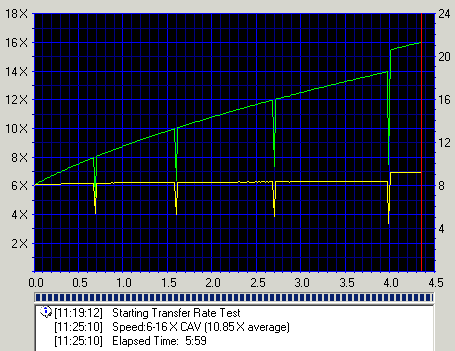
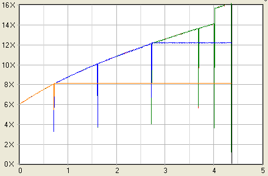
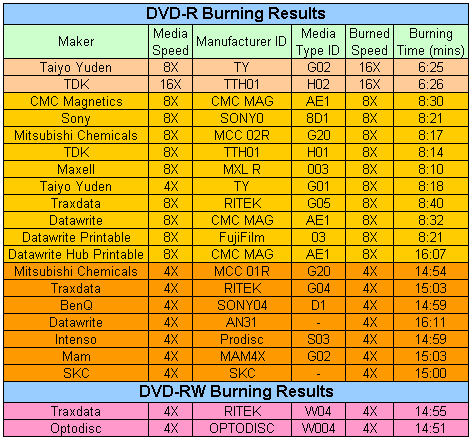
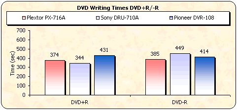
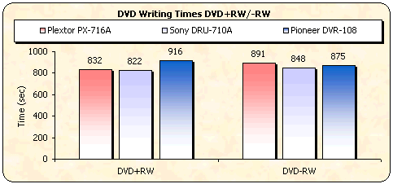
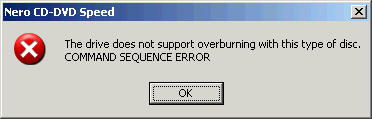
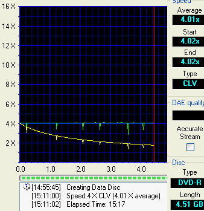

# 12. DVD Recording Tests

#### Review Pages

[1. Introduction](README.md)  
[2. Transfer Rate Reading Tests](page-02.md)  
[3. CD Error Correction Tests](page-03.md)  
[4. DVD Error Correction Tests](page-04.md)  
[5. Protected Disc Tests](page-05.md)  
[6. DAE Tests](page-06.md)  
[7. Protected AudioCDs](page-07.md)  
[8. CD Recording Tests](page-08.md)  
[9. Writing Quality Tests - 3T Jitter Tests](page-09.md)  
[10. Writing Quality Tests - C1 / C2 Error Measurements](page-10.md)  
[11. Writing Quality Tests - Clover System Tests](page-11.md)  
**12. DVD Recording Tests**  
[13. Autostrategy](page-13.md)  
[14. PlexTools Scans - Page 1](page-14.md)  
[15. PlexTools Scans - Page 2](page-15.md)  
[16. PlexTools Scans - Page 3](page-16.md)  
[17. PlexTools Scans - Page 4](page-17.md)  
[18. PlexTools Scans - Page 5](page-18.md)  
[19. PlexTools Scans - Page 6](page-19.md)  
[20. PlexTools Scans - Page 7](page-20.md)  
[21. PlexTools Scans - Page 8](page-21.md)  
[22. DVD+R DL - Page 1](page-22.md)  
[23. DVD+R DL - Page 2](page-23.md)  
[24. PX-716A vs. SA300 - Page 1](page-24.md)  
[25. PX-716A vs. SA300 - Page 2](page-25.md)  
[26. PX-716A vs. SA300 - Page 3](page-26.md)  
[27. PX-716A vs. SA300 - Page 4](page-27.md)  
[28. Booktype BitSetting](page-28.md)  
[29. Conclusion](page-29.md)  
[30. Firmware 1c04 beta - Page 2](page-30.md)  
[31. Q-Check TA Function](page-31.md)  
[32. Firmware 1c04 beta - Page 1](page-32.md)  

### **Plextor PX-716A Burner - Page 12**

***DVD Recording Tests***

**- Writing Performance**

The maximum supported speeds are 16X (CAV) for DVD±R formats, 8X (P-CAV) for DVD+RW, 4X CLV for DVD-RW, and 4X CLV for DVD+R DL media. The current firmware revisions (1.02/1.03) don't support 8X +RW writing with 8X +RW media; probably the upcoming 1.04 will fix this. Nero Burning ROM reported speeds are shown below.

We used Nero CD-DVD Speed's "create disc" function in order to confirm the 8X, 12X, and 16X recording strategies. Click on the images below for the full CDSpeed screenshots.

***16X DVD+R Single Layer writing***

Despite the fact that the PX-716A is advertised as a 16X +R burner, the drive didn't manage to reach the 16X writing speed, instead dropping its writing speed to 12X at the 4.0GB point. It's quite possible that Plextor will further improve the drive's performance with a firmware upgrade.

***12X DVD+R Single Layer writing***

A nice P-CAV writing graph from the PX-716A with a total recording time of 6:26 mins.

***8X DVD+R Single Layer writing***

P-CAV also for the 8X writing speed...

***16X DVD-R Single Layer writing***

The 16X -R writing graph was rather strange; the drive's writing speed jumps up at 4.0GB from 14X to 16X...

Below is a PlexTools writing graph showing the writing strategy for 16X/12X/8X when using Verbatim 16X +R media:

**- Supported media list/Burning Tests**

We burned 4315 MB of data on various DVD±R and DVD±RW media. We used the maximum allowed writing speed for each disc. The drive proved capable of recording at higher speeds than those certified for many media brands.

**- Writing Time Results**

***DVD+R media***

***DVD-R media***

**- Comparison with other drives**

As can be seen from the graphs above, there's not a whole lot between the burners, with the Sony drive possibly providing the best overall performance, being fastest in 3 out of the 4 formats.

**- DVD Overburning Test**

The drive supports overburning for the DVD+R format.

Unfortunately, this is not something that you'll see with DVD-R media.

The Plextor PX-716A supports writing to BeALL 4.85GB DVD-R media, as CDSpeed showed:

**- DVD+MRW Tests**

This feature is also not supported.

#### Review Pages

[1. Introduction](README.md)  
[2. Transfer Rate Reading Tests](page-02.md)  
[3. CD Error Correction Tests](page-03.md)  
[4. DVD Error Correction Tests](page-04.md)  
[5. Protected Disc Tests](page-05.md)  
[6. DAE Tests](page-06.md)  
[7. Protected AudioCDs](page-07.md)  
[8. CD Recording Tests](page-08.md)  
[9. Writing Quality Tests - 3T Jitter Tests](page-09.md)  
[10. Writing Quality Tests - C1 / C2 Error Measurements](page-10.md)  
[11. Writing Quality Tests - Clover System Tests](page-11.md)  
**12. DVD Recording Tests**  
[13. Autostrategy](page-13.md)  
[14. PlexTools Scans - Page 1](page-14.md)  
[15. PlexTools Scans - Page 2](page-15.md)  
[16. PlexTools Scans - Page 3](page-16.md)  
[17. PlexTools Scans - Page 4](page-17.md)  
[18. PlexTools Scans - Page 5](page-18.md)  
[19. PlexTools Scans - Page 6](page-19.md)  
[20. PlexTools Scans - Page 7](page-20.md)  
[21. PlexTools Scans - Page 8](page-21.md)  
[22. DVD+R DL - Page 1](page-22.md)  
[23. DVD+R DL - Page 2](page-23.md)  
[24. PX-716A vs. SA300 - Page 1](page-24.md)  
[25. PX-716A vs. SA300 - Page 2](page-25.md)  
[26. PX-716A vs. SA300 - Page 3](page-26.md)  
[27. PX-716A vs. SA300 - Page 4](page-27.md)  
[28. Booktype BitSetting](page-28.md)  
[29. Conclusion](page-29.md)  
[30. Firmware 1c04 beta - Page 2](page-30.md)  
[31. Q-Check TA Function](page-31.md)  
[32. Firmware 1c04 beta - Page 1](page-32.md)  

[« first](README.md) | [‹ previous](page-11.md) | [1](README.md) | [2](page-02.md) | [3](page-03.md) | [4](page-04.md) | [5](page-05.md) | [6](page-06.md) | [7](page-07.md) | [8](page-08.md) | [9](page-09.md) | [10](page-10.md) | [11](page-11.md) | **12** | [13](page-13.md) | [14](page-14.md) | [15](page-15.md) | [16](page-16.md) | … | [next ›](page-13.md) | [last »](page-32.md)
