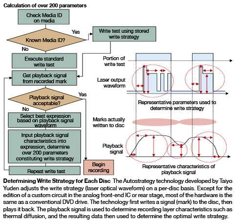
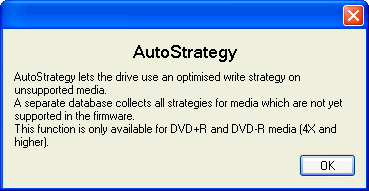
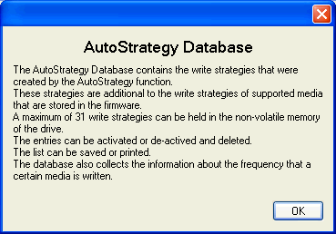
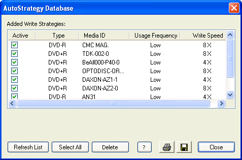
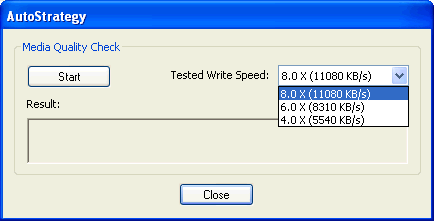
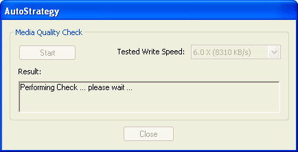
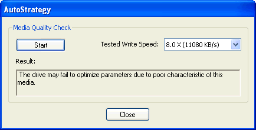
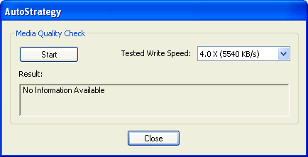

# 13. Autostrategy

#### Review Pages

[1. Introduction](README.md)  
[2. Transfer Rate Reading Tests](page-02.md)  
[3. CD Error Correction Tests](page-03.md)  
[4. DVD Error Correction Tests](page-04.md)  
[5. Protected Disc Tests](page-05.md)  
[6. DAE Tests](page-06.md)  
[7. Protected AudioCDs](page-07.md)  
[8. CD Recording Tests](page-08.md)  
[9. Writing Quality Tests - 3T Jitter Tests](page-09.md)  
[10. Writing Quality Tests - C1 / C2 Error Measurements](page-10.md)  
[11. Writing Quality Tests - Clover System Tests](page-11.md)  
[12. DVD Recording Tests](page-12.md)  
**13. Autostrategy**  
[14. PlexTools Scans - Page 1](page-14.md)  
[15. PlexTools Scans - Page 2](page-15.md)  
[16. PlexTools Scans - Page 3](page-16.md)  
[17. PlexTools Scans - Page 4](page-17.md)  
[18. PlexTools Scans - Page 5](page-18.md)  
[19. PlexTools Scans - Page 6](page-19.md)  
[20. PlexTools Scans - Page 7](page-20.md)  
[21. PlexTools Scans - Page 8](page-21.md)  
[22. DVD+R DL - Page 1](page-22.md)  
[23. DVD+R DL - Page 2](page-23.md)  
[24. PX-716A vs. SA300 - Page 1](page-24.md)  
[25. PX-716A vs. SA300 - Page 2](page-25.md)  
[26. PX-716A vs. SA300 - Page 3](page-26.md)  
[27. PX-716A vs. SA300 - Page 4](page-27.md)  
[28. Booktype BitSetting](page-28.md)  
[29. Conclusion](page-29.md)  
[30. Firmware 1c04 beta - Page 2](page-30.md)  
[31. Q-Check TA Function](page-31.md)  
[32. Firmware 1c04 beta - Page 1](page-32.md)  

### **Plextor PX-716A Burner - Page 13**

***AutoStrategy***

Inexpensive but poor-quality appendable digital video discs (DVD) are becoming increasingly common. As a result, write faults and other problems are also becoming more frequent during recording. For users who save their precious image data or irreplaceable photographs to appendable DVDs, constant write faults and data loss are simply unacceptable.

To address this problem, Taiyo Yuden has developed a technology named Autostrategy which reduces recording errors by automatically adjusting the write strategy on a per-disc basis. Normally specific write strategies already available in the DVD drive are used for recording to discs from the major media manufacturers, but now write performance can be improved even without them. Because the adjustment is made on a per-disc basis, recording errors will be reduced for quality fluctuations in both media type and individual disc characteristics.

Taiyo Yuden hopes to license the technology widely to recording DVD drive manufacturers and establish it as an industry standard. The first drive featuring the technology has already been released: the **PX-716** Series from Shinano Kenshi Corp. of Japan, offering recording at up to 16x speed. The drive uses Autostrategy technology before writing to DVD-R or DVD+R single-layer media. The technology is implemented in an IC manufactured by Sanyo Electric Co., Ltd. of Japan.

When the new function is used in the PX-716 Series, it takes 30s to get the Media ID, used to detect media type, and another two and a half minutes to determine the optimal write strategy. Even so, Shinano Kenshi has said, once the optimal write strategy has been determined for a specific media, write will begin much sooner on successive discs of the same type. Write strategies for 40 media are automatically stored in internal memory. Autostrategy can also be launched manually to determine the optimal write strategy for individual media, even if already registered.

The term "Intelligent Recording" covers a number of critical aspects that ensure the quality of reading and writing functionality. 'AutoStrategy' is a self-learning writing technology for developing a writing strategy. The advantage is that here we achieve good writing quality on unprecedented media. "IntelligentTilt" controls the laser in three dimensions, with the purpose of achieving equivalent writing and reading quality in the case of surface imperfections. Finally, 'PoweRec' is a complex piece of writing intelligence ensuring superior recording quality at high speeds on certified media.

In other words, with this pioneering technology, when the drive comes to burn media that is not included in the firmware, the first time it performs a test recording, it does so in such a way that the second time it burns it with the highest possible quality.

The Autostrategy function works silently behind the scenes, meaning that after every burn, the drive may add several media to its firmware list. PlexTools gives additional information regarding this. Note that this list isn't erased after a firmware upgrade. It's quite possible that Plextor will further fine-tune the AutoStrategy function since, with the current 1.03 firmware, it doesn't seem to work for high-quality media...

Below is a list of media we have already burned with the drive

In the case of new media, the user can test if an allowed writing speed can be safe for recording...

After the test had ended, the results were rather disappointing, 8X is not acceptable with the tested media:

After testing the 4X and 6X writing speeds, PlexTools didn't provide any information about the test result...

We tried to confirm this feature by making some tests using DVD+R media from Creation. The ID code for the media is POMSC001002. There is a great difference in recording time between the first and the second attempt. In the first case, the time needed was 10:06min, while in the second it was only 7:47min. The third and the fourth discs were burned with similar times, at 7:48min and 7:49 respectively. Unfortunately, all four discs reported reading errors in both CDSpeed and PlexTools, in the beginning of the reading or scanning processes. Probably, Plextor needs to further fine-tune this technology before it is of practical use.

#### Review Pages

[1. Introduction](README.md)  
[2. Transfer Rate Reading Tests](page-02.md)  
[3. CD Error Correction Tests](page-03.md)  
[4. DVD Error Correction Tests](page-04.md)  
[5. Protected Disc Tests](page-05.md)  
[6. DAE Tests](page-06.md)  
[7. Protected AudioCDs](page-07.md)  
[8. CD Recording Tests](page-08.md)  
[9. Writing Quality Tests - 3T Jitter Tests](page-09.md)  
[10. Writing Quality Tests - C1 / C2 Error Measurements](page-10.md)  
[11. Writing Quality Tests - Clover System Tests](page-11.md)  
[12. DVD Recording Tests](page-12.md)  
**13. Autostrategy**  
[14. PlexTools Scans - Page 1](page-14.md)  
[15. PlexTools Scans - Page 2](page-15.md)  
[16. PlexTools Scans - Page 3](page-16.md)  
[17. PlexTools Scans - Page 4](page-17.md)  
[18. PlexTools Scans - Page 5](page-18.md)  
[19. PlexTools Scans - Page 6](page-19.md)  
[20. PlexTools Scans - Page 7](page-20.md)  
[21. PlexTools Scans - Page 8](page-21.md)  
[22. DVD+R DL - Page 1](page-22.md)  
[23. DVD+R DL - Page 2](page-23.md)  
[24. PX-716A vs. SA300 - Page 1](page-24.md)  
[25. PX-716A vs. SA300 - Page 2](page-25.md)  
[26. PX-716A vs. SA300 - Page 3](page-26.md)  
[27. PX-716A vs. SA300 - Page 4](page-27.md)  
[28. Booktype BitSetting](page-28.md)  
[29. Conclusion](page-29.md)  
[30. Firmware 1c04 beta - Page 2](page-30.md)  
[31. Q-Check TA Function](page-31.md)  
[32. Firmware 1c04 beta - Page 1](page-32.md)  

[« first](README.md) | [‹ previous](page-12.md) | … | [9](page-09.md) | [10](page-10.md) | [11](page-11.md) | [12](page-12.md) | **13** | [14](page-14.md) | [15](page-15.md) | [16](page-16.md) | [17](page-17.md) | … | [next ›](page-14.md) | [last »](page-32.md)
