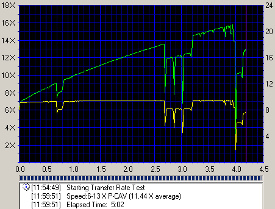
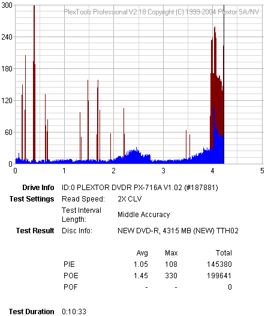
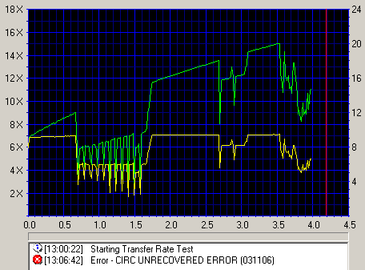
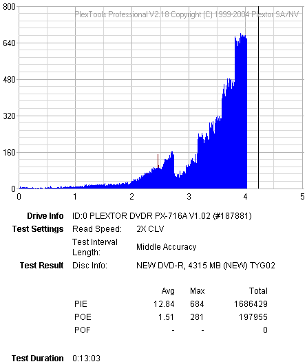

# 18. PlexTools Scans - Page 5

#### Review Pages

[1. Introduction](README.md)  
[2. Transfer Rate Reading Tests](page-02.md)  
[3. CD Error Correction Tests](page-03.md)  
[4. DVD Error Correction Tests](page-04.md)  
[5. Protected Disc Tests](page-05.md)  
[6. DAE Tests](page-06.md)  
[7. Protected AudioCDs](page-07.md)  
[8. CD Recording Tests](page-08.md)  
[9. Writing Quality Tests - 3T Jitter Tests](page-09.md)  
[10. Writing Quality Tests - C1 / C2 Error Measurements](page-10.md)  
[11. Writing Quality Tests - Clover System Tests](page-11.md)  
[12. DVD Recording Tests](page-12.md)  
[13. Autostrategy](page-13.md)  
[14. PlexTools Scans - Page 1](page-14.md)  
[15. PlexTools Scans - Page 2](page-15.md)  
[16. PlexTools Scans - Page 3](page-16.md)  
[17. PlexTools Scans - Page 4](page-17.md)  
**18. PlexTools Scans - Page 5**  
[19. PlexTools Scans - Page 6](page-19.md)  
[20. PlexTools Scans - Page 7](page-20.md)  
[21. PlexTools Scans - Page 8](page-21.md)  
[22. DVD+R DL - Page 1](page-22.md)  
[23. DVD+R DL - Page 2](page-23.md)  
[24. PX-716A vs. SA300 - Page 1](page-24.md)  
[25. PX-716A vs. SA300 - Page 2](page-25.md)  
[26. PX-716A vs. SA300 - Page 3](page-26.md)  
[27. PX-716A vs. SA300 - Page 4](page-27.md)  
[28. Booktype BitSetting](page-28.md)  
[29. Conclusion](page-29.md)  
[30. Firmware 1c04 beta - Page 2](page-30.md)  
[31. Q-Check TA Function](page-31.md)  
[32. Firmware 1c04 beta - Page 1](page-32.md)  

### **Plextor PX-716A Burner - Page 18**

***PlexTools Scans - Page 5***

In order to test the writing quality and readability of the burned media, we used two readers in combination with two software packages:

- The LiteON SOHD-167T with patched firmware being able to read DVD5 up to 16X CAV and DVD9 up to 10X CAV. For the transfer rate tests, we used the latest Nero CDSpeed version.
- The Plextor PX-716A with the latest available firmware. For scanning the disc, we used the latest PlexTools version at 2X CLV reading speed, BURST mode, with middle accuracy.

In general, a "perfect" disc should have a smooth reading curve, very low PIE/POE and zero (0) POF error rates. Most times, even when a disc has very low PIE/POE error rates, the reading curve may not be smooth with drop-offs. Due to the fact that we oversped the reading capabilities of the LiteON SOHD-167T, such drops are expected, especially near the outer area of the disc.

The measurements below should be taken not as the absolute criteria of the burning quality, but as an indication level.

#### **16X DVD-R Writing Speed**

- ***TDK 16X DVD-R @ 16X***

- ***Taiyo Yuden 8X DVD-R @ 16X***

**- Summary**

The writing quality at 16X for the minus format needs some improvement. The Taiyo Yuden media, which is certified for 8X, reported reading errors in both CDSpeed and PlexTools. TDK, however, which is a certified 16X media, performed well.

#### Review Pages

[1. Introduction](README.md)  
[2. Transfer Rate Reading Tests](page-02.md)  
[3. CD Error Correction Tests](page-03.md)  
[4. DVD Error Correction Tests](page-04.md)  
[5. Protected Disc Tests](page-05.md)  
[6. DAE Tests](page-06.md)  
[7. Protected AudioCDs](page-07.md)  
[8. CD Recording Tests](page-08.md)  
[9. Writing Quality Tests - 3T Jitter Tests](page-09.md)  
[10. Writing Quality Tests - C1 / C2 Error Measurements](page-10.md)  
[11. Writing Quality Tests - Clover System Tests](page-11.md)  
[12. DVD Recording Tests](page-12.md)  
[13. Autostrategy](page-13.md)  
[14. PlexTools Scans - Page 1](page-14.md)  
[15. PlexTools Scans - Page 2](page-15.md)  
[16. PlexTools Scans - Page 3](page-16.md)  
[17. PlexTools Scans - Page 4](page-17.md)  
**18. PlexTools Scans - Page 5**  
[19. PlexTools Scans - Page 6](page-19.md)  
[20. PlexTools Scans - Page 7](page-20.md)  
[21. PlexTools Scans - Page 8](page-21.md)  
[22. DVD+R DL - Page 1](page-22.md)  
[23. DVD+R DL - Page 2](page-23.md)  
[24. PX-716A vs. SA300 - Page 1](page-24.md)  
[25. PX-716A vs. SA300 - Page 2](page-25.md)  
[26. PX-716A vs. SA300 - Page 3](page-26.md)  
[27. PX-716A vs. SA300 - Page 4](page-27.md)  
[28. Booktype BitSetting](page-28.md)  
[29. Conclusion](page-29.md)  
[30. Firmware 1c04 beta - Page 2](page-30.md)  
[31. Q-Check TA Function](page-31.md)  
[32. Firmware 1c04 beta - Page 1](page-32.md)  

[« first](README.md) | [‹ previous](page-17.md) | … | [14](page-14.md) | [15](page-15.md) | [16](page-16.md) | [17](page-17.md) | **18** | [19](page-19.md) | [20](page-20.md) | [21](page-21.md) | [22](page-22.md) | … | [next ›](page-19.md) | [last »](page-32.md)
