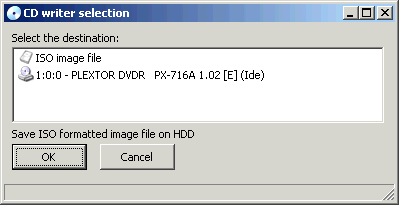
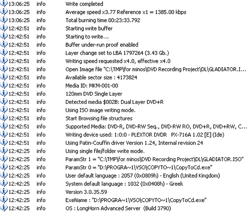
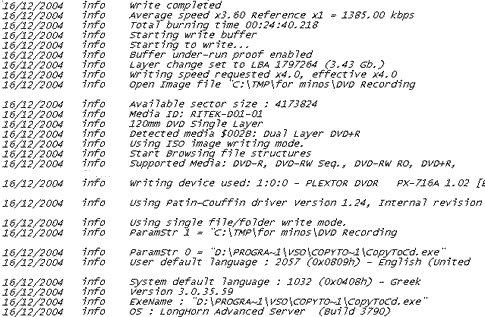
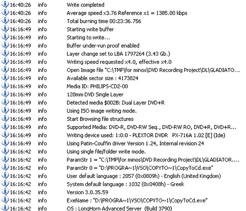
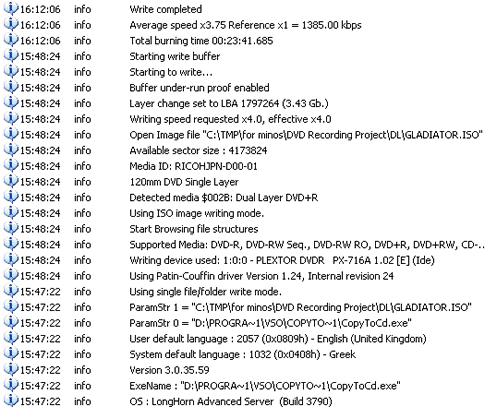

# 22. DVD+R DL - Page 1

#### Review Pages

[1. Introduction](README.md)  
[2. Transfer Rate Reading Tests](page-02.md)  
[3. CD Error Correction Tests](page-03.md)  
[4. DVD Error Correction Tests](page-04.md)  
[5. Protected Disc Tests](page-05.md)  
[6. DAE Tests](page-06.md)  
[7. Protected AudioCDs](page-07.md)  
[8. CD Recording Tests](page-08.md)  
[9. Writing Quality Tests - 3T Jitter Tests](page-09.md)  
[10. Writing Quality Tests - C1 / C2 Error Measurements](page-10.md)  
[11. Writing Quality Tests - Clover System Tests](page-11.md)  
[12. DVD Recording Tests](page-12.md)  
[13. Autostrategy](page-13.md)  
[14. PlexTools Scans - Page 1](page-14.md)  
[15. PlexTools Scans - Page 2](page-15.md)  
[16. PlexTools Scans - Page 3](page-16.md)  
[17. PlexTools Scans - Page 4](page-17.md)  
[18. PlexTools Scans - Page 5](page-18.md)  
[19. PlexTools Scans - Page 6](page-19.md)  
[20. PlexTools Scans - Page 7](page-20.md)  
[21. PlexTools Scans - Page 8](page-21.md)  
**22. DVD+R DL - Page 1**  
[23. DVD+R DL - Page 2](page-23.md)  
[24. PX-716A vs. SA300 - Page 1](page-24.md)  
[25. PX-716A vs. SA300 - Page 2](page-25.md)  
[26. PX-716A vs. SA300 - Page 3](page-26.md)  
[27. PX-716A vs. SA300 - Page 4](page-27.md)  
[28. Booktype BitSetting](page-28.md)  
[29. Conclusion](page-29.md)  
[30. Firmware 1c04 beta - Page 2](page-30.md)  
[31. Q-Check TA Function](page-31.md)  
[32. Firmware 1c04 beta - Page 1](page-32.md)  

### **Plextor PX-716A Burner - Page 22**

***DVD+R DL - Page 1***

The PX-716A model supports 4X recording speed for the DVD+R DL format. In the following table are summarized all the media we tried with the specific drive:

**- Writing Tests**

We burned four different DVD+R DL discs with DVD-Video content. The source disc was "Gladiator Movie - Special Edition" disc 1 with a total size of 6.86GB. First, we transferred the movie to the hard disc with DVD Decrypter as ISO format (single file). Afterwards, we used CopyToDVD v3.0.35.

First, we tried with **Verbatim Double Layer media**. CopyToDVD reported **23:33 mins** total burning time with **3.77X** average writing speed.

Then we repeated the same task, this time with media from **Traxdata**. CopyToDVD reported **24:40 mins** total burning time with **3.6X** average writing speed.

Afterwards, we tried media from **Philips**. CopyToDVD reported **23:36 mins** total burning time with **3.76X** average writing speed.

Finally, we again repeated the task, with Ricoh media this time. According to CopyToDVD, the recording time was **23:41 mins** with an average speed of **3.75X**.

For comparison, we post some burning results from other DL writers, which all burned the same content ("Gladiator Movie - Special Edition" disc 1), using the CopyToDVD software:

| Drive | Time (min) |
| --- | ---: |
| **Plextor PX-716A** | 23:33 |
| NEC ND-3520A | 22:35 |
| Freecom FX-50 | 22.40 |
| Pioneer DVR-108 | 23:10 |
| Sony DRU-710A | 23:04 |

#### Review Pages

[1. Introduction](README.md)  
[2. Transfer Rate Reading Tests](page-02.md)  
[3. CD Error Correction Tests](page-03.md)  
[4. DVD Error Correction Tests](page-04.md)  
[5. Protected Disc Tests](page-05.md)  
[6. DAE Tests](page-06.md)  
[7. Protected AudioCDs](page-07.md)  
[8. CD Recording Tests](page-08.md)  
[9. Writing Quality Tests - 3T Jitter Tests](page-09.md)  
[10. Writing Quality Tests - C1 / C2 Error Measurements](page-10.md)  
[11. Writing Quality Tests - Clover System Tests](page-11.md)  
[12. DVD Recording Tests](page-12.md)  
[13. Autostrategy](page-13.md)  
[14. PlexTools Scans - Page 1](page-14.md)  
[15. PlexTools Scans - Page 2](page-15.md)  
[16. PlexTools Scans - Page 3](page-16.md)  
[17. PlexTools Scans - Page 4](page-17.md)  
[18. PlexTools Scans - Page 5](page-18.md)  
[19. PlexTools Scans - Page 6](page-19.md)  
[20. PlexTools Scans - Page 7](page-20.md)  
[21. PlexTools Scans - Page 8](page-21.md)  
**22. DVD+R DL - Page 1**  
[23. DVD+R DL - Page 2](page-23.md)  
[24. PX-716A vs. SA300 - Page 1](page-24.md)  
[25. PX-716A vs. SA300 - Page 2](page-25.md)  
[26. PX-716A vs. SA300 - Page 3](page-26.md)  
[27. PX-716A vs. SA300 - Page 4](page-27.md)  
[28. Booktype BitSetting](page-28.md)  
[29. Conclusion](page-29.md)  
[30. Firmware 1c04 beta - Page 2](page-30.md)  
[31. Q-Check TA Function](page-31.md)  
[32. Firmware 1c04 beta - Page 1](page-32.md)  

Pages: [« first](README.md) | [‹ previous](page-21.md) | … | [18](page-18.md) | [19](page-19.md) | [20](page-20.md) | [21](page-21.md) | **22** | [23](page-23.md) | [24](page-24.md) | [25](page-25.md) | [26](page-26.md) | … | [next ›](page-23.md) | [last »](page-32.md)
