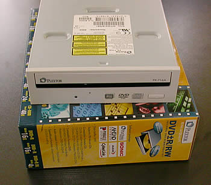

# 30. Conclusion

#### Review Pages

[1. Introduction](README.md)  
[2. Transfer Rate Reading Tests](page-02.md)  
[3. CD Error Correction Tests](page-03.md)  
[4. DVD Error Correction Tests](page-04.md)  
[5. Protected Disc Tests](page-05.md)  
[6. DAE Tests](page-06.md)  
[7. Protected AudioCDs](page-07.md)  
[8. CD Recording Tests](page-08.md)  
[9. Writing Quality Tests - 3T Jitter Tests](page-09.md)  
[10. Writing Quality Tests - C1 / C2 Error Measurements](page-10.md)  
[11. Writing Quality Tests - Clover System Tests](page-11.md)  
[12. DVD Recording Tests](page-12.md)  
[13. Autostrategy](page-13.md)  
[14. PlexTools Scans - Page 1](page-14.md)  
[15. PlexTools Scans - Page 2](page-15.md)  
[16. PlexTools Scans - Page 3](page-16.md)  
[17. PlexTools Scans - Page 4](page-17.md)  
[18. PlexTools Scans - Page 5](page-18.md)  
[19. PlexTools Scans - Page 6](page-19.md)  
[20. PlexTools Scans - Page 7](page-20.md)  
[21. PlexTools Scans - Page 8](page-21.md)  
[22. DVD+R DL - Page 1](page-22.md)  
[23. DVD+R DL - Page 2](page-23.md)  
[24. PX-716A vs. SA300 - Page 1](page-24.md)  
[25. PX-716A vs. SA300 - Page 2](page-25.md)  
[26. PX-716A vs. SA300 - Page 3](page-26.md)  
[27. PX-716A vs. SA300 - Page 4](page-27.md)  
[28. Booktype BitSetting](page-28.md)  
[29. Conclusion](page-29.md)  
**30. Firmware 1c04 beta - Page 2**  
[31. Q-Check TA Function](page-31.md)  
[32. Firmware 1c04 beta - Page 1](page-32.md)  

### **Plextor PX-716A Burner - Page 30**

***Conclusion***

After having finally finished our full suite of tests, it is now much easier to come to some conclusions. Firstly, as a reader the drive is fast with low seek times and good CD error correction, with especially good behavior with the CD-Check Audio Test Disc, which most drives find difficult to read. With the DVD format, the drive is also a fast reader, even with RW discs where most drives' performance is average, reaching 6X while the Plextor drive reached 9X. The PX-716A continues to have an impressive ripping speed with DVD-Video DL movies as was the case with its predecessor the PX-712A. The average 9.6X ripping speed reminds us more of a DVD-ROM than a DVD burner. Continuing with the same format, error correction was expected to be much stronger than it eventually proved. The performance with some of our test discs was poor.

The ripping performance with CD protected games was also good especially with the SafeDisc protection scheme, where most drives encounter major problems. In this task, the Plextor drive is simply unbeatable. However, when it comes to making working backups of the same protection scheme, it can only handle up to v2.8, which is a typical performance.

In our DAE tests, the reading speed at 40X is good but we would like to see the 90min and 99min test discs read. Both reported reading errors just before the end of the process. CD Audio protections, such as CDS200 and Key2Audio are not a problem for the drive, but when we tried to back up the Aiko test disc with CDS200 protection, the output disc had several errors.

As far as CD writing quality is concerned, this should be better with lower jitter levels and without E32 errors. We expect this to be fixed with the upcoming firmware revision.

The DVD writing tests reported that the drive managed to burn many media at higher speeds than certified. The quality can be considered as very good for most; however, there were a few cases of poor quality or reading errors. The DVD+/-RW recording quality is a minor issue with the specific firmware but we believe that this too can be fixed with the upcoming firmware revision.

With DVD+R DL media, the drive performed well and managed to burn with good quality three out of the four media we tried. The bitsetting feature for this format increased the compatibility, which we can confirm after loading the discs on our test standalone players from Philips, Pioneer and NeuNeo. In the near future, the drive will also support the DVD-R DL format with, you guessed it, a newer firmware revision.

As we stated above, the drive supports the booktype change feature for the DVD+R and DVD+R DL formats. Unfortunately, this is not something we will see for the DVD+RW format. We would like this to be added in the near future.

*Intelligent Recording* with *Autostrategy* doesn't seem to function as was advertised, but this is something that may be fixed with new firmware upgrades. The recent announcement of support for 6X DVD±R DL writing speed makes it one of the fastest available DL recorders, and also makes the drive more complete but the competition will make its presence with the arrival of writers with the same or even faster writing speeds.

The price of the burner at the time of this review was around $133, which is a little high. Drives with similar specifications can be found for around $80. You can expect further review updates when new firmware revisions arrive with improved writing features.

***- The Good***

- 16X recording speed for both DVD+R and DVD-R media
- Supports most DVD+R DL media at 4X
- Will support 6X DVD±R DL with firmware upgrade
- Supports overburning with CD-R/RW media
- Supports overburning with DVD+R media
- Good DVD-R and DVD+R DL writing quality
- High CD reading speed
- Very fast ripping DVD-Video DL movies
- Fast ripping for protected game discs, especially with SafeDisc protection
- Good CD error correction
- Can be used to measure (scan) DVD±R/RW media with a variety of tests (PI/PIF/Jitter)
- Can read/rip protected Audio discs (CDS200, Key2Audio)
- Supports bitsetting for DVD+R and DVD+R DL formats

***- The Bad***

- Cannot back up copy protected games with versions newer than 2.8 of SafeDisc protection
- Doesn't support reading of DVD-RAM media
- Reading performance with 90/99min test media
- Many errors when backing up CDS200 protected disc

***- Like To be fixed***

- Burning quality with specific DVD media
- Lower price to compete with upcoming Pioneer DVR-109, NEC ND-3520A
- Poor DVD±RW writing quality
- Poor CD recording quality
- Bitsetting option for DVD+RW media to be added
- Low DVD error correction with several test discs
- Autostrategy/Intelligent recording

<table>
  <tr>
    <td><strong>Retail Package</strong></td>
    <td></td>
  </tr>
  <tr>
    <td><strong>Reading</strong></td>
    <td></td>
  </tr>
  <tr>
    <td><strong>Error Correction</strong></td>
    <td></td>
  </tr>
  <tr>
    <td><strong>Protected Discs</strong></td>
    <td></td>
  </tr>
  <tr>
    <td><strong>Writing</strong></td>
    <td></td>
  </tr>
  <tr>
    <td><strong>Features</strong></td>
    <td></td>
  </tr>
</table>

#### Review Pages

[1. Introduction](README.md)  
[2. Transfer Rate Reading Tests](page-02.md)  
[3. CD Error Correction Tests](page-03.md)  
[4. DVD Error Correction Tests](page-04.md)  
[5. Protected Disc Tests](page-05.md)  
[6. DAE Tests](page-06.md)  
[7. Protected AudioCDs](page-07.md)  
[8. CD Recording Tests](page-08.md)  
[9. Writing Quality Tests - 3T Jitter Tests](page-09.md)  
[10. Writing Quality Tests - C1 / C2 Error Measurements](page-10.md)  
[11. Writing Quality Tests - Clover System Tests](page-11.md)  
[12. DVD Recording Tests](page-12.md)  
[13. Autostrategy](page-13.md)  
[14. PlexTools Scans - Page 1](page-14.md)  
[15. PlexTools Scans - Page 2](page-15.md)  
[16. PlexTools Scans - Page 3](page-16.md)  
[17. PlexTools Scans - Page 4](page-17.md)  
[18. PlexTools Scans - Page 5](page-18.md)  
[19. PlexTools Scans - Page 6](page-19.md)  
[20. PlexTools Scans - Page 7](page-20.md)  
[21. PlexTools Scans - Page 8](page-21.md)  
[22. DVD+R DL - Page 1](page-22.md)  
[23. DVD+R DL - Page 2](page-23.md)  
[24. PX-716A vs. SA300 - Page 1](page-24.md)  
[25. PX-716A vs. SA300 - Page 2](page-25.md)  
[26. PX-716A vs. SA300 - Page 3](page-26.md)  
[27. PX-716A vs. SA300 - Page 4](page-27.md)  
[28. Booktype BitSetting](page-28.md)  
[29. Conclusion](page-29.md)  
**30. Firmware 1c04 beta - Page 2**  
[31. Q-Check TA Function](page-31.md)  
[32. Firmware 1c04 beta - Page 1](page-32.md)  

Pages: [« first](README.md) | [‹ previous](page-29.md) | … | [24](page-24.md) | [25](page-25.md) | [26](page-26.md) | [27](page-27.md) | [28](page-28.md) | [29](page-29.md) | **30** | [31](page-31.md) | [32](page-32.md) | [next ›](page-31.md) | [last »](page-32.md)
